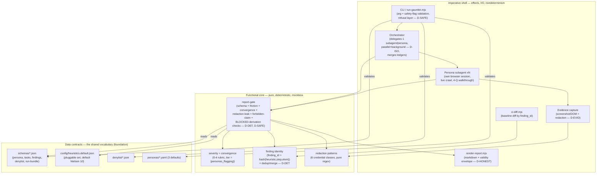
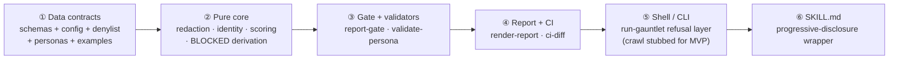

# Architecture Description — ux-gauntlet MVP

> This is the governing design artifact. Per SWEBOK/ISO-12207 the architectural-design process
> sits **between** the frozen requirements (spec 0001) and construction: it decides the system
> structures, the block we build **first**, and the boundaries construction must respect. The spec
> says *what*; this says *how it is structured and in what order it is built*. Construction conforms
> to this document; where code and this AD disagree, one of them is a defect.

Each section names the SWEBOK gate it satisfies (see `~/swe-corpus/skills/swe-architecture`).

---

## 1. Architectural drivers (the concerns that are fundamental) — GATE stakeholder-concern-trace, fundamentality-filter

Only structures that serve these drivers are treated as architecture; everything else is construction detail.

| # | Driver (architecturally significant requirement) | Stakeholder / concern | Spec source |
|---|---|---|---|
| D-SAFE | The tool ACTS on a live third-party app; a wrong action is irreversible (deleted account, real charge, leaked secret). The refusal layer must be **structurally impossible to bypass**, not a per-caller courtesy. | Operator (must not damage their app); target's real users (must not leak their data) | F37-F44, F61-F68, F101, refusal layer |
| D-DET | Findings must be **deterministically gate-checkable** so CI can block and re-runs are comparable, despite LLM nondeterminism upstream. | Operator running CI; founder trusting the report | F18-F24, F45/F46, F72-F74, F92/F165, F191 |
| D-ISO | Personas run **concurrently and isolated** (own browser session, no shared state) so convergence tiers mean something and one persona can't contaminate another. | Report reader (convergence = reliability) | F16/F17, F30-F32, F88 |
| D-EVID | Every finding is **evidence-anchored**; zero-evidence findings are dropped, secrets are redacted before evidence touches disk. | Operator (report is auditable, not a leak) | F14/F15, F43/F44, F166/F167 |
| D-PORT | Packaged as a portable agent-skill (Claude Code first, Codex where feasible), degrading honestly where a runtime lacks delegation/background. | Adopter of the OSS skill | N1/N2, F97, F37 |
| D-HONEST | The report states its own validity envelope every run (simulated users find breakdowns; they do not predict WTP/conversion/population rates). | Founder acting on the report | F20-F22, F35, F70/F71 |

**Fundamentality filter applied:** the browser driver, the LLM model choice, and the YAML/JSON file
formats are **not** architecture — they are substitutable construction choices. The *contracts*
(schemas), the *gate* (refusal + validation), and the *delegation topology* ARE architecture,
because reasoning about D-SAFE/D-DET/D-ISO depends on them and not on the substitutable parts.

---

## 2. Reasoning structures — Logical view (GATE architecture-reasoning-structure, view-concern-link, viewpoint-defined)

**Viewpoint:** component-and-connector; elements = modules/components, relations = "depends-on"/"validates-against"/"delegates-to", properties = pure-vs-effectful and which driver each serves. Addresses D-SAFE, D-DET, D-ISO, D-EVID.

**Recompose (separation of concerns → whole):** the shell orchestrates effects; every *judgment*
(is this a leak? is the tier right? is the run BLOCKED?) lives in the pure core and is the same
function the gate and CI both call — so a finding cannot be "valid in the report but invalid in CI."

---

## 3. The starting block + construction order — Dependency view (answers the founder's "de quel bloc on part")

**Decision: construction starts at the DATA CONTRACTS + the GATE, not at the browser.**

Rationale (GATE adr-decision-basis): the frozen acceptance suite is **gate-driven** — 87 tests, and
the overwhelming majority exercise `report-gate.mjs --check-fixture <json>` against schemas. The
browser crawl is the *last* and most substitutable block (D-PORT: it can even be stubbed while the
contracts + gate are fully real and fully tested). Everything depends on the contracts; nothing the
contracts depend on. Building the browser first would produce untestable code with no contract to
validate against — inverted dependency order.

Construction proceeds ①→⑥; each block is GREEN (its tests pass) before the next starts. This is the
order the running build must follow; if it built ⑤ before ①-③ it will be reworked.

---

## 4. Process / deployment view — persona isolation & degradation (GATE view-concern-link; addresses D-ISO, D-PORT)

- **One subagent per persona**, spawned parallel + background, each with its **own browser profile**
  (no shared cookies/localStorage/session — F88). The orchestrator is a barrier: it waits for all
  ledgers, then merges. Concurrency is capped (`--max-parallel`, default 5) so an open persona set
  cannot DoS the target.
- **Degradation (D-PORT):** on a runtime without Task/subagent delegation or background execution,
  the skill declares sequential-fallback unsupported/unverified (F97) rather than silently serializing.
- **Run-status derivation** (BLOCKED) is computed in the pure core from the per-persona terminal
  states and **gate-locked** (F191) — the shell cannot hand-set it.

---

## 5. Core / Shell boundary — the module-boundary rule construction MUST respect (coding-standards.md)

| Layer | Contains | Rule |
|---|---|---|
| **Functional core** | redaction regexes, finding-identity hash + dedup, severity/convergence scoring, BLOCKED derivation, all gate *judgments* | Pure. No browser, no fs writes, no network, no `process.exit`. Same input → same output. Tested with plain assertions, zero mocks. |
| **Imperative shell** | CLI parsing, refusal/exit codes, subagent delegation, browser driving, evidence capture to disk, stdout/stderr, ci-diff file I/O | Orchestrates the core with plain data. May do I/O. Owns effects and nondeterminism. |

**Enforcement:** the core exposes pure functions; `report-gate.mjs`/`ci-diff.mjs` (shell) call them
and translate the verdict into exit codes. A leak-check or a tier-check living in the shell instead
of the core is an architecture violation caught in the quality phase (§7).

---

## 6. Requirement-cluster → component traceability (GATE multi-view-consistency, stakeholder-concern-trace)

| Component | Owns requirement clusters | Driver |
|---|---|---|
| schemas/*.json | F1/F5, F18, F53, F118, F156, F92/F165 shape | D-DET |
| config/heuristics.default.json | F11/F24/F28/F150 (pluggable taxonomy) | D-DET |
| core: redaction | F43/F44, F166/F167, F102/F153/F199 (6 classes to totality) | D-EVID, D-SAFE |
| core: identity+dedup | F45/F46, F92/F165, F17 | D-DET |
| core: scoring | F12/F136/F159/F161/F162, F17 | D-DET |
| core: BLOCKED derivation | F49/F53/F101/F173-F176/F191 | D-DET, D-ISO |
| report-gate.mjs (shell→core) | F14/F15, F20-F24, F35, F108 | D-EVID, D-HONEST, D-DET |
| run-gauntlet.mjs (shell) | F6/F7/F8, F37-F42, F61/F65/F67, F80, F98, F107/F108, ADR-0001 | D-SAFE, D-PORT |
| orchestrator + subagents (shell) | F16, F30-F32, F88, F49 derivation input | D-ISO |
| evidence capture (shell) | F14, F60/F182, redaction call | D-EVID |
| render-report.mjs (shell→core) | F19/F20/F35/F70/F71 | D-HONEST |
| ci-diff.mjs (shell→core) | F26/F72-F74/F101/F151/F200/F201 | D-DET |
| SKILL.md | N1/N2, F9 walkthrough keywords, F97 | D-PORT |

Every architectural component traces to ≥1 driver and ≥1 requirement cluster; every driver is owned. No orphans.

---

## 7. Software-quality phase plan (ISO 12207 §6.4.6/6.4.9 V&V — the "make sure of software quality" step, run AFTER construction)

Construction being GREEN (87 tests pass) is necessary, not sufficient. The quality phase adds:

1. **Test-suite integrity** — the RED→GREEN transition is honest: no test/fixture/spec was edited to pass (SSOT rule). Verify: `git diff` on `test/**` since freeze shows zero changes; `freeze.json` sha still matches.
2. **Architecture conformance** — core purity holds: grep the core modules for `import` of browser/fs/net and for `process.exit` → must be empty; every gate judgment resolves to a core function.
3. **Deterministic-gate teeth (negative control)** — mutate a passing fixture (e.g. flip a redaction, break a tier) → the gate must go RED. A gate that stays green on a mutant is a fake gate (founder's Goodhart rule).
4. **Disjoint review** — a fresh reviewer (never the builder) audits code vs this AD + the frozen spec, per the founder's separate-author/reviewer rule. Sign-off recorded.
5. **swe-corpus quality gates** — coverage-audit + test-coverage-audit stay green post-build.

DONE_VERIFIED is asserted only when 1-5 pass, not when the tests first go green.

---

## 8. Architecture Decision Records (GATE adr-decision-basis, rationale-alternatives-rejections)

- **ADR-0001** (existing) — runner CLI + exit-code contract.
- **ADR-0002** — Functional-core / imperative-shell split with all gate judgments in the pure core. *Alternative rejected:* gate logic inline in each script → rejected because CI and the report would each re-implement the judgment and could disagree (violates D-DET).
- **ADR-0003** — Contracts-first construction order (start block = schemas+gate, browser last/stubbable). *Alternative rejected:* browser-first vertical slice → rejected: inverts the dependency graph, produces untestable code with no contract to validate against.
- **ADR-0004** — Zero runtime dependencies (self-contained JSON-Schema checks + minimal YAML parse). *Alternative rejected:* pull ajv + js-yaml → rejected for an OSS skill where supply-chain surface and install friction are D-PORT costs; revisit only if hand-rolled validation proves insufficient.

(ADR-0002..0004 authored as `docs/adr/0002..0004-*.md`.)
