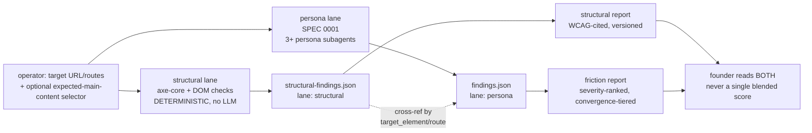

# Decision Brief: Structural UI-Quality Lane (feeds SPEC 0002)

**Scope**: spec input for a second, DETERMINISTIC audit lane in `ux-gauntlet` — accessibility (WCAG) +
semantic structure + main-content correctness + interactive-component correctness — run alongside,
never merged into, the existing persona-friction lane (SPEC 0001).
**Research basis**: 7 load-bearing claims independently 3-vote adversarially checked, all
majority-survived; 3 carry a disclosed dissenting-vote caveat (WCAG 4.1.2 "value" scope, WCAG 1.4.1
sufficient-technique scope, Deque's self-reported coverage %) folded into §2 and §3 below rather than
hidden. 12 additional claims used with explicit hedge framing (no adversarial vote run). 7 claims
KILLED and excluded — most importantly, "no-skipped-heading-levels is a machine-testable WCAG 1.3.1
requirement" did NOT survive, so heading-order checks in this brief are framed as an axe-core
best-practice rule, never as a normative WCAG failure. 20 sources indexed in §7.

---

## 1. Problem Statement + Composition with the Persona-Friction Lane

SPEC 0001 (`docs/specs/0001-ux-gauntlet-mvp.spec.md`) explicitly deferred this scope: *"No
accessibility audit (route to a dedicated corpus/skill; out of scope here to avoid diluting the
friction-economics focus)"* (SPEC 0001 §7 non-goals). This brief is that dedicated lane.

The two lanes answer **different questions with different epistemics** and must never be collapsed
into one number:

| | Structural lane (this brief) | Persona lane (SPEC 0001) |
|---|---|---|
| Question | Is the UI **code-correct**? (name/role/value exposed, contrast passes, landmarks/headings sane, declared main content actually in `<main>`) | Is the UI **usable** for a specific buyer intent? (extra steps, ambiguity, abandonment) |
| Judge | axe-core + deterministic DOM/CSS checks — **zero LLM judgment** | LLM-simulated persona subagents — inherently probabilistic (SPEC 0001 §3 discloses ~45% real-user agreement ceiling) |
| Reproducibility | Same DOM + same axe-core version + same config ⇒ identical violation-id set, every run | Convergence tiers across 3 personas, not byte-identical across runs |
| Output | `severity` is a pure function of axe's own `impact` field (§4) | `severity` is a 3-factor formula partly derived from persona walkthrough judgments |
| Failure mode if merged | Hides *which axis moved* — "score went from 72→81" tells a founder nothing actionable | — |

**Do NOT double-count.** A structural violation (e.g., an unlabeled button) and a persona-lane
friction instance triggered by that same button (e.g., "persona couldn't tell what this does") are
**two different findings in two different schemas**, cross-referenced by a shared `target_element`
identifier and the run's shared `route`/`url`, never merged into one entry or one severity value. The
structural lane is a cheap, fast, pre-flight signal; the persona lane is the expensive, high-fidelity
one. Composition, not fusion:

Recommended (open decision §6.3): the structural lane can act as a **cheap gate before** the persona
lane runs — e.g., refuse to burn 3 persona subagents auditing a page whose primary CTA has no
accessible name at all — but that is a sequencing optimization, not a scoring fusion.

---

## 2. What the Structural Lane MUST Check

Each item: citable rule → deterministic check. Two-axis tags per `spec-criticality.md`.

### (a) Accessibility / WCAG — via axe-core

- **[CRITICAL][BLOCKS:critical] Name, Role, Value for every interactive component.** WCAG 2.2 SC
  4.1.2 (Level A): *"For all user interface components…the name and role can be programmatically
  determined; states, properties, and values that can be set by the user can be programmatically
  set…"* [1]. **Caveat disclosed, not smoothed over**: "value" is only required where a component
  has user-settable state — a plain link has no value to expose — so the check is *name+role always,
  value where applicable*, not a uniform triple on every element. Deterministic check: axe-core
  `button-name`, `link-name`, `input-button-name`, `select-name`, `aria-required-attr`,
  `aria-valid-attr-value` [5].
- **[CRITICAL][BLOCKS:high] Contrast minimum — 4.5:1 normal text / 3:1 large text (≥18pt, or
  ≥14pt bold), no rounding.** WCAG 2.2 SC 1.4.3 (AA) [2]; WebAIM confirms with the canonical
  `#777777` (4.47:1) failing example [3]. Deterministic check: axe-core `color-contrast`, which
  extracts computed foreground/background color **and** font-size/weight to select the applicable
  threshold before computing the ratio — neither dimension alone is sufficient [2][3]. 4.499:1 fails;
  no leniency band.
- **[HIGH][BLOCKS:medium] Labels/instructions on form inputs.** WCAG 2.2 SC 3.3.2 (Level A):
  labels or instructions when content requires user input [1]. Deterministic check: axe-core
  `label`, `aria-input-field-name`.
- **[MEDIUM][BLOCKS:low] Use of color is not the sole means of conveying information**, most
  commonly links distinguished from body text only by color. WCAG SC 1.4.1 (Level A) [1]; a
  documented sufficient technique (G183) requires ≥3:1 contrast against surrounding text **plus** a
  non-color cue on hover/focus [3]. **Caveat disclosed**: G183 is *one* sufficient technique, not the
  only conformant path (a static always-visible underline alone also satisfies 1.4.1 with no contrast
  math) — the check flags the G183 gap specifically, it does not assert 1.4.1 is violated whenever
  G183 isn't used.

### (b) Semantic structure — landmarks & headings

- **[HIGH][BLOCKS:medium] Exactly one `<main>` landmark.** Best-practice axe rule, not a bare
  WCAG SC — disclose this provenance in the report, don't dress it up as a Level A/AA failure.
  Deterministic check: axe-core `landmark-one-main` [10]. Moderate impact per Deque's own
  classification.
- **[MEDIUM][BLOCKS:low] All rendered content is contained within a landmark.** Deterministic
  check: axe-core `region` [16] — catches boilerplate/chrome leaking outside any landmark.
- **[HIGH][BLOCKS:medium] Landmark roles are valid and correctly nested** (of the 8 WAI-ARIA
  landmark types: banner, navigation, main, search, form, region, complementary, contentinfo) [8][9].
  Native HTML5 elements (`<header>`, `<nav>`, `<main>`, `<footer>`) are preferred over explicit
  `role=` where supported [9]. A bare `<section>` gets `region` landmark status **only** when labeled
  via `aria-labelledby`/`aria-label`/`title` [8] — an unlabeled `<section>` is a coverage gap the
  checker must flag, not silently skip.
- **[MEDIUM][BLOCKS:low] Heading order is a sane outline** (one `<h1>`, no level skipped).
  **Framed explicitly as an axe-core best-practice heuristic** ([5], ~3 dedicated rules, e.g. "ensure
  the order of headings is semantically correct"), backed by WebAIM's practitioner guidance [11] —
  **not** cited as a hard WCAG 1.3.1 normative failure (that broader claim did not survive adversarial
  check — see KILLED, top of file). Report this class of finding with a visibly different label
  ("best-practice") than true WCAG SC violations.
- **[HIGH][BLOCKS:medium] A bypass mechanism exists** (skip-to-content link, or landmark-based
  navigation an assistive-tech user can rely on). WCAG SC 2.4.1 (Level A) [12], with landmark-based
  bypass grounded in ARIA11 [14]. Deterministic check: presence of a working skip link (visible on
  focus, `href` resolving to the main content) OR presence of a valid `main` landmark reachable via
  landmark navigation.
- **[MEDIUM][BLOCKS:none] DOM order approximates visual reading order.** Technique C27 [13].
  Deterministic-*ish*: compare DOM order of focusable/content nodes against rendered bounding-box
  top-to-bottom/left-to-right order; flag mismatches above a configurable threshold. **This is a
  heuristic, not a binary WCAG pass/fail** — multi-column layouts, CSS Grid `order`, and RTL content
  produce legitimate mismatches. Surface as a flagged-for-review signal, never a hard gate in MVP
  (see §5 non-goals).

### (c) Main-content correctness, including operator-declared expected content

- **[CRITICAL][BLOCKS:high] The primary content region is the one exposed as `<main>`/`role="main"`.**
  Grounded in ARIA11 [14] and the APG's own worked main-landmark example [15]. This is the
  structural lane's headline differentiator over a bare axe-core wrapper: it ties the audit to *this
  specific app's intent*, not generic linting.
  - **Primary mode (operator-declared, required for a CRITICAL-gated result):** the operator supplies
    a CSS selector or text anchor expected to resolve *inside* the detected `<main>` landmark. The
    check is a pure containment test — fully deterministic, no inference.
  - **Fallback mode (no selector supplied):** auto-detect the primary content block via a
    Readability-style density/link-ratio scorer, adapted from Mozilla's reference implementation
    [17][18], whose accuracy against extractor benchmarks is peer-reviewed [19]. **This fallback
    output is inherently inferential** (a scoring heuristic, not a containment test) and MUST be
    labeled lower-confidence in the report — it downgrades the finding's tag from a hard check to an
    advisory one (see §5, deferred to v2 for the CRITICAL gate).
- **[HIGH][BLOCKS:medium] Reuse of the one-`<main>` rule from (b)** applies here too: a page with
  zero or 2+ `<main>` landmarks cannot have a deterministic "is expected content inside main" answer,
  so that check MUST fail closed (report "cannot evaluate: ambiguous main," never a false pass) when
  the landmark count isn't exactly 1.

### (d) Interactive-component correctness

- **[CRITICAL][BLOCKS:critical] Name/role/value correctness for custom widgets** (ARIA state
  validity: `aria-expanded`, `aria-selected`, `aria-checked` match actual widget state) — reuses (a)'s
  axe ruleset [1][5].
- **[HIGH][BLOCKS:low] No positive `tabindex` misuse** (an anti-pattern that breaks natural tab
  order) — deterministic DOM check, cheap and fully automatable, kept in MVP even though full
  keyboard-operability testing is not (below).
- **[disclosed gap, not gated — see §3/§5] Focus order (WCAG 2.4.3) and focus-visible
  presence (WCAG 2.4.7 / 2.4.13 [7]) are 0% automatable per Deque's own criteria-level coverage data
  [4]**, corroborating why this lane does **not** claim to gate on them in MVP — see §3 for the exact
  figures and §5 for the explicit non-goal. Full keyboard-trap and keyboard-operability testing is
  likewise excluded for the same reason.

---

## 3. Validity Envelope — What This Lane Can and Cannot Claim

**MUST be printed in every structural report, every run**, mirroring SPEC 0001's non-optional
disclosure discipline (SPEC 0001 §3/F20-F22, F171, F206-F208).

### The cited automation ceiling

Deque's own report [4], run across 13,000+ first-time audits (~300k issues), states automated
testing (axe-core) catches **57.38% of total issues by issue-volume**, and covers **16 of 50 WCAG 2.1
Level AA criteria (~32%) by criteria-count** — with wide variance by criterion: contrast, parsing, and
language-of-page criteria are 83–92% automatable, while **Focus Order and Focus Visible are 0%
automatable** [4]. WebAIM's independent WAVE-engine survey of the top 1M home pages [6] corroborates
that automated tooling reliably finds *some* class of failure at scale (95.9% of pages have at least
one detectable failure) but that is a prevalence statistic, not an automation-coverage statistic — do
not conflate the two numbers in the shipped report.

**Disclosed methodological caveat (do not omit):** the 57.38%/32% figures are self-reported by
Deque, the maker of axe-core — not independently audited — and the 57.38% figure uses an
issue-*volume* metric that structurally overweights high-frequency, easy-to-automate issue types
(contrast, missing alt text) versus the criteria-count metric (~32%) it's contrasted against. Report
the criteria-count figure (~32%, 16/50) as the more conservative, less vendor-favorable ceiling
whenever the two are cited together, and label 57.38% explicitly as "vendor-reported, issue-volume
weighted."

### Three axes — do not conflate

1. **Structural pass** = zero axe-core violations at the configured severity floor + passing
   semantic/landmark/main-content checks. A code-conformance measure. This lane.
2. **Usable** = a real (or simulated) person can complete their task without undue friction. SPEC
   0001's persona lane. A structural pass does not imply this — a page can have perfect ARIA and
   still make a VP-buyer persona give up at a confusing pricing table.
3. **Good UI** = aesthetic/brand/visual craft quality. **Out of scope for both lanes.** Route to
   visual-verdict/design-review tooling; ux-gauntlet does not score aesthetics.

### MUST disclaim, every run

- **Not a WCAG conformance certification.** Only ~32% of AA success criteria are automatable by
  criteria-count [4]; a "structural: PASS" result means *zero automatically-detectable violations at
  this severity floor*, not "WCAG 2.2 AA conformant." Many Level A/AA criteria (focus order, keyboard
  traps, meaningful sequence in complex layouts, plain-language criteria) structurally cannot be
  evaluated by this lane and require manual/assistive-technology testing.
- **Zero violations ≠ no accessibility problems.** Name that gap by criterion class in the report
  (at minimum: focus order, focus visible, keyboard operability — all 0% automatable per [4]).
- **Heading-order and DOM-order findings are best-practice heuristics, not WCAG SC violations** —
  labeled with a visibly distinct severity semantic from true WCAG failures (§2b).
- **The Readability-fallback main-content check is inferential, not a containment test** — label it
  lower-confidence whenever the operator hasn't declared an expected-content selector (§2c).
- **axe-core version + ruleset config must be pinned and disclosed in report metadata** — coverage
  and even individual pass/fail outcomes shift across tool versions; an unpinned lane is not
  reproducible and this lane's entire value proposition is reproducibility (§4).
- **Structural findings are never merged with persona-lane findings into one score** (§1). A founder
  reading only a blended number cannot tell whether their problem is "the button has no label" or
  "three personas gave up on this page" — those require different fixes.

---

## 4. Severity Mapping + Determinism Requirement

axe-core reports one of four `impact` levels on every violation: `minor`, `moderate`, `serious`,
`critical` [5]. Map onto ux-gauntlet's shared 0–4 ordinal scale (reused from SPEC 0001 §2.3 for
report-format consistency, **not** because the same formula computes it):

| axe `impact` | ux-gauntlet severity |
|---|---|
| `critical` | 4 |
| `serious` | 3 |
| `moderate` | 2 |
| `minor` | 1 |
| *(axe result type `incomplete` — "needs manual review", not a pass)* | **0**, surfaced, never dropped |

**`incomplete` results are never silently dropped or reported as passing.** Mirrors SPEC 0001's
"zero-evidence findings are dropped, not softened" discipline in the opposite direction: here, a
result axe itself could not automatically resolve is *always* surfaced as a severity-0 "needs manual
review" entry, precisely because reporting it as a pass would be the false-negative failure mode this
whole lane exists to avoid.

**Determinism requirements (non-negotiable, this is the lane's entire reason to exist):**

1. **axe-core version pinned exactly** (lockfile-pinned or vendored) and **ruleset tag config**
   (`wcag2a`, `wcag2aa`, `wcag21aa`, `wcag22aa`, `best-practice`) declared and stored in report
   metadata, every run.
2. **Same DOM snapshot + same axe-core version + same config ⇒ identical violation-id set.** This
   is a testable invariant — a golden-fixture regression test (same pattern as SPEC 0001's
   runtime-generated-fixture anti-gaming tests) should assert it before this lane is trusted in CI.
3. **Severity is a pure function of axe's own `impact` field.** No persona/LLM judgment enters this
   lane anywhere — that is the entire distinction from the persona lane's judgment-influenced 3-factor
   formula (§1), and it must never be blurred.
4. **Dedup rule**: same axe rule ID + same target-element selector (or its resolved accessibility-tree
   node) = one finding, one entry — never split across runs by DOM-node-reference instability.
5. **An axe-core version bump is a decision-record-worthy event** per `decision-record-discipline.md`
   — a version bump can silently add/retire rules or reclassify impact levels underneath what a
   founder assumes is a "stable" report; log it, don't let it happen invisibly.

---

## 5. MVP Scope + Explicit Non-Goals

### MVP scope

- **[CRITICAL][BLOCKS:critical]** axe-core integration (Playwright-driven), full ruleset run
  (`wcag2a`+`wcag2aa`+`wcag21aa`+`wcag22aa`+`best-practice` tags), one run per operator-supplied
  route, fully deterministic per §4.
- **[CRITICAL][BLOCKS:critical]** Name/role/value + form-label checks via axe rules (§2a).
- **[CRITICAL][BLOCKS:high]** Contrast checks via axe `color-contrast` (§2a).
- **[CRITICAL][BLOCKS:high]** Exactly-one-`<main>` + operator-declared expected-main-content
  containment check (§2c, primary mode only — no Readability fallback, see non-goals).
- **[HIGH][BLOCKS:medium]** Landmark presence/roles (8 types), region-containment, bypass-block
  presence (§2b).
- **[MEDIUM][BLOCKS:low]** Heading-order best-practice check, explicitly labeled non-normative
  (§2b).
- **[HIGH][BLOCKS:low]** Positive-`tabindex` anti-pattern check (§2d).
- **[CRITICAL][BLOCKS:high]** Severity mapping (axe `impact` → 0-4) with `incomplete` always
  surfaced at 0, never dropped (§4).
- **[CRITICAL][BLOCKS:critical]** Schema-validated JSON output, structurally parallel to SPEC
  0001's `findings.json` but with a **mandatory `lane: "structural"` discriminator field** so no
  downstream tool can conflate the two axes even by accident.
- **[CRITICAL][BLOCKS:low]** Validity-envelope disclosure block, mandatory in every report (§3).
- **[HIGH][BLOCKS:medium]** axe-core version + ruleset config pinned and disclosed in report
  metadata (§4).

### Explicit non-goals for MVP

- **[MEDIUM][BLOCKS:none]** No DOM-vs-visual-order check — heuristic, judgment-heavy, deferred to
  v2 (§2b).
- **[HIGH][BLOCKS:none]** No focus-order / focus-visible gating — 0% automatable per cited Deque
  data [4]; disclosed as a manual-testing gap in the validity envelope, never a pass/fail gate.
- **[HIGH][BLOCKS:none]** No keyboard-trap / full keyboard-operability testing — same rationale.
- **[MEDIUM][BLOCKS:none]** No Readability-style auto-detected main-content fallback — MVP requires
  an operator-declared selector for a CRITICAL-gated result; the inferential fallback is a v2
  advisory-only feature (§2c).
- **[MEDIUM][BLOCKS:none]** No multi-route/site-wide crawl — single operator-supplied route list per
  run, mirroring SPEC 0001's founder-supplied-happy-path discipline (never agent-invented scope).
- **[CRITICAL][BLOCKS:none]** No merging structural + persona severities into one "UX score" — the
  two reports stay separate artifacts, cross-referenced by run ID and `target_element`, never
  algebraically combined (§1, §3). Paramount to the lane's integrity even though it blocks nothing
  downstream.
- **[LOW][BLOCKS:none]** No WCAG AAA criteria in the MVP gate — AAA is largely impractical as a
  site-wide conformance target per WCAG's own guidance; can be added as advisory-only later.
- **[CRITICAL][BLOCKS:none]** No criterion axe marks `incomplete` is ever reported as "passed" (§4)
  — a discipline, not a feature, but worth stating as an explicit non-goal of the *reporting* surface:
  MVP does not ship a "simplify to pass/fail" report mode that would hide this distinction.

---

## 6. Open Decisions for the Founder

1. **CI gate strictness**: should structural-lane `severity: 4` findings block merge the same way
   persona-lane severity-4 findings do (SPEC 0001 §6), or should structural get a stricter bar — e.g.,
   any axe `critical`-impact violation blocks regardless of the 0-4 mapping, since these are
   deterministic (no persona-reliability discount applies)?
2. **Expected-main-content requirement**: always require an operator-declared selector (refuse to run
   without one, mirroring SPEC 0001's happy-path refusal-to-start pattern — my recommendation, for
   determinism), or ship the Readability-heuristic fallback in MVP with a loud low-confidence label
   instead of deferring it to v2?
3. **Lane sequencing in the orchestrator**: should a structural-lane failure gate whether the persona
   lane even runs (cheap pre-flight: don't burn 3 persona subagents auditing a page whose primary CTA
   has no accessible name), or should the two lanes stay fully independent/parallel with no
   cross-lane gating at all?
4. **WCAG target level**: gate on AA only (industry-standard baseline in most jurisdictions — my
   recommendation), or make the target level configurable/pluggable the way SPEC 0001 makes the
   heuristic set pluggable (default Nielsen 10, swappable)?
5. **axe-core version-pin policy**: pin to an exact version and require an explicit decision record to
   bump (strict reproducibility — my recommendation, per §4's determinism requirement), or auto-update
   within a semver range with a report-metadata diff trail showing what changed?
6. **Schema family**: should structural output live in the *same* findings-schema family as SPEC 0001
   (discriminated by the `lane` field, one CI diff script handles both), or ship as a fully separate
   schema/report artifact with its own gate script?

---

## 7. Source List

1. W3C — Web Content Accessibility Guidelines (WCAG) 2.2, W3C Recommendation — https://www.w3.org/TR/WCAG22 (cited SC anchors: 4.1.2 Name/Role/Value, 3.3.2 Labels or Instructions, 1.4.1 Use of Color)
2. W3C WAI — Understanding SC 1.4.3: Contrast (Minimum) — https://www.w3.org/WAI/WCAG22/Understanding/contrast-minimum.html
3. WebAIM — Contrast and Color Accessibility — https://webaim.org/articles/contrast
4. Deque — The Automated Accessibility Coverage Report — https://www.deque.com/automated-accessibility-coverage-report
5. dequelabs/axe-core — rule-descriptions.md (GitHub) — https://github.com/dequelabs/axe-core/blob/develop/doc/rule-descriptions.md
6. WebAIM — The WebAIM Million 2026 — https://webaim.org/projects/million
7. W3C WAI — Understanding SC 2.4.7 Focus Visible / SC 2.4.13 Focus Appearance — https://www.w3.org/WAI/WCAG22/Understanding/focus-visible.html
8. W3C WAI-ARIA APG — Landmark Regions — https://www.w3.org/WAI/ARIA/apg/practices/landmark-regions
9. W3C WAI-ARIA APG — HTML5 Sectioning Elements: ARIA Landmarks Example — https://www.w3.org/WAI/ARIA/apg/patterns/landmarks/examples/HTML5.html
10. Deque University — landmark-one-main axe rule (v4.6) — https://dequeuniversity.com/rules/axe/4.6/landmark-one-main
11. WebAIM — Headings — https://webaim.org/techniques/headings
12. W3C WAI — Understanding SC 2.4.1 Bypass Blocks — https://www.w3.org/WAI/WCAG21/Understanding/bypass-blocks.html
13. W3C — Technique C27: Making the DOM order match the visual order — https://www.w3.org/WAI/WCAG21/Techniques/css/C27
14. W3C — Technique ARIA11: Using ARIA landmarks to identify regions of a page — https://www.w3.org/WAI/WCAG21/Techniques/aria/ARIA11
15. W3C WAI-ARIA APG — Main Landmark: ARIA Landmarks Example — https://www.w3.org/WAI/ARIA/apg/patterns/landmarks/examples/main.html
16. Deque University — region axe rule (v4.1) — https://dequeuniversity.com/rules/axe/4.1/region
17. mozilla/readability (GitHub) — https://github.com/mozilla/readability
18. WebcrawlerAPI Blog — Mozilla Readability Algorithm (Readability.js) explained — https://webcrawlerapi.com/blog/mozilla-readability-algorithm-readabilityjs
19. Bevendorff et al. — An Empirical Comparison of Web Content Extraction Algorithms, SIGIR 2023 — https://dl.acm.org/doi/10.1145/3539618.3591920

**Research evidence**: 7 load-bearing claims adversarially 3-vote checked, all majority-survived
(3 carry a disclosed dissenting-vote caveat, folded inline rather than smoothed over — see §2a's
WCAG 4.1.2/1.4.1 scope notes and §3's Deque self-interest disclosure). 12 additional claims used
with explicit hedge framing (no adversarial vote recorded — landmark/section/heading-count-of-rules
detail claims in §2b, focus-appearance area-exemption detail, "one main landmark" convention claim).
7 claims KILLED and excluded from this brief, most consequentially: "heading hierarchy with no skipped
levels is a machine-testable WCAG 1.3.1 requirement" (did not survive — heading-order is reported here
strictly as an axe-core best-practice heuristic, §2b) and the "single correct sRGB luminance
implementation, no human judgment" framing of contrast calculation (did not survive as stated — the
formula itself is standard, but the exception classes around it require judgment, disclosed in §3).
