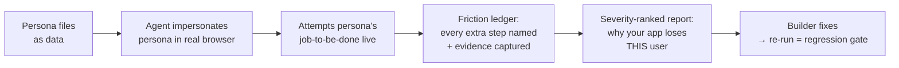

# 0000 — Problem Analysis (draft)

> Every statement here is a **hypothesis** until the deep-research decision brief
> (`docs/research/DECISION-BRIEF.md`) confirms or kills it. Per SWEBOK requirements
> discipline: elicit → analyze → specify → validate. This file is the *analyze* step.

## The problem

Builders (especially solo founders using coding agents) ship apps whose UX was never
adversarially exercised by anyone who *doesn't already know how the app works*. Real user
testing is slow, expensive, and arrives after launch. Existing agentic testing tools check
"does the flow work" (QA) — not "does the flow *annoy a specific kind of human with a
specific willingness to pay*" (experience + conversion).

**Result:** friction that is invisible to the builder silently kills activation and conversion.

## The core loop (proposed)

## Draft requirements (two-axis tags per spec-criticality scale)

### CRITICAL
- [CRITICAL][BLOCKS:critical] Personas are **data files** (goals, patience budget, willingness to pay, tech literacy, expected happy path), not prompt folklore. The skill ships a starter set incl. free-tier refuser, willing-to-pay evaluator, VP/team buyer.
- [CRITICAL][BLOCKS:critical] Live crawl of a real running app in a real browser — no static analysis, no mocks.
- [CRITICAL][BLOCKS:high] **Friction accounting rule:** any action required beyond the persona's expected happy path is recorded as a named friction with evidence (screenshot / step trace / count).
- [CRITICAL][BLOCKS:high] Report is severity-ranked using an established scale (candidate: Nielsen severity 0–4), every finding evidence-linked. Maximum-critique stance: the report's job is to say why the app is bad, not to be nice.

### HIGH
- [HIGH][BLOCKS:low] Grounding in citable methodology: heuristic evaluation, cognitive walkthrough, interaction-cost/KLM-style step counting, ISO 9241-11 usability framing.
- [HIGH][BLOCKS:low] Honest validity envelope: the report must state what an LLM-simulated user can and cannot claim (per academic evidence — e.g. good at finding breakdowns, weak at predicting real WTP).
- [HIGH][BLOCKS:low] Deterministic quality gates inside the skill (scripts that PASS/BLOCK): e.g. a run is invalid unless every finding has evidence; a report without a friction ledger does not ship.
- [HIGH][BLOCKS:none] Portable agent-skill packaging (SKILL.md + progressive disclosure), works in Claude Code; Codex-compatible where feasible.

### MEDIUM
- [MEDIUM][BLOCKS:none] CI mode: run the gauntlet on release, diff friction count vs last run (dogfooding automation).
- [MEDIUM][BLOCKS:none] Custom persona authoring guide + validator script.

### LOW (convergence tail)
- [LOW][BLOCKS:none] Multi-persona comparative summary ("the VP converts, the free user rage-quits at step 3").
- [LOW][BLOCKS:none] GIF/video capture of the persona's journey.

## Non-goals (draft)
- Not a load/perf tool, not a security scanner, not a replacement for real user research (it's the pre-filter before humans).
- No claim of statistically valid preference or pricing prediction.

## Open questions (for research + founder)
1. Browser substrate: Claude-in-Chrome vs Playwright MCP vs agent-browser — which maximizes portability?
2. Severity scale: Nielsen 0–4 vs custom friction-cost score?
3. How to keep persona behavior *consistent* (temperature of impersonation) so re-runs are comparable?
4. Name: `ux-gauntlet` is the working title — founder veto welcome.
