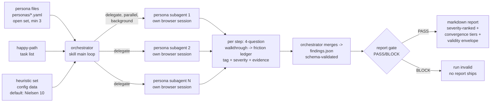

# Feature: ux-gauntlet MVP — persona-driven friction audit skill

## Summary

An MIT-licensed agent skill (Claude Code first, Codex-compatible where feasible) that runs an
**open, extensible set of personas** — 3 buyer-intent defaults shipped (free-tier user,
willing-to-pay user, VP/team buyer); minimum 3 per run for convergence reliability, no upper
bound; one data file = one persona — through an operator-supplied happy-path task list against a
live web app. **Each persona executes as an independent delegated subagent, in parallel, in the
background, with its own browser session.** Every extra action is recorded as a named friction
instance with evidence, tagged against exactly one criterion from the **configured heuristic set
(pluggable data; default: Nielsen 10)**, scored 0–4 via the NN/g 3-factor rubric (frequency,
impact, persistence) plus a separate market-impact flag. The orchestrator merges the per-persona
ledgers into a schema-validated JSON findings file from which a severity-ranked markdown report
is generated — always carrying the validity-envelope disclosure (simulated users find breakdowns;
they do not predict WTP, conversion, or population rates).

White space claimed (per decision brief §4): buyer-economic persona differentiation +
citable heuristic/severity methodology + installable SKILL.md packaging + CI dogfood loop.
No existing open tool combines these.

## Architecture of a run



## Scenarios (Gherkin)

```gherkin
Scenario: run refuses to start without a happy path          # F7 F8
  Given a target URL but no happy-path task list
  When the operator invokes the skill
  Then the skill refuses to start the crawl
  And it explains that the happy path is operator-defined in MVP

Scenario: an extra step becomes a named, evidenced friction  # F10 F11 F12 F14
  Given the free-tier persona pursuing task "sign up and reach the dashboard"
  And the happy path expects 4 steps
  When the app forces an email-verification detour of 2 extra actions
  Then the ledger records one friction instance naming the detour
  And the instance carries exactly one criterion tag from the configured heuristic set
  And a 0-4 severity score from the frequency-impact-persistence rubric
  And at least one evidence artifact (screenshot, DOM snippet, or click trace)

Scenario: a walkthrough "No" always becomes a friction        # F9 F33
  Given the persona answers "No" to the discoverability question at step 2
  When the step record is written
  Then a friction instance exists for step 2
  And a findings file containing a "No" answer with no matching friction fails the report gate

Scenario: a finding without evidence is dropped, not softened  # F15
  Given a finding whose evidence artifact reference is empty
  When the report is generated
  Then that finding is absent from both findings.json and the markdown report

Scenario: three personas produce convergence tiers            # F16 F17
  Given a standard audit run
  When it completes
  Then at least 3 personas have executed the same task list
  And every finding carries a convergence tier equal to the number of personas that flagged it

Scenario: every report carries the validity envelope          # F20 F21 F22
  Given any completed run
  When the markdown report is generated
  Then it contains the validity-envelope disclosure section
  And it contains no willingness-to-pay estimate
  And it contains no population-percentage extrapolation

Scenario: the gate blocks an untagged finding                 # F18 F23 F24
  Given a findings.json where one finding lacks a heuristic tag
  When the report gate script runs
  Then it exits nonzero and no report ships

Scenario: persona validator rejects a malformed persona       # F1 F5 F25
  Given a persona file missing the patience-threshold field
  When the persona validator runs
  Then it exits nonzero and names the missing field

Scenario: CI blocks only on new catastrophes                  # F26
  Given a committed baseline report and a new run with one new severity-4 finding
  When CI mode compares the run to the baseline
  Then the process exits nonzero
  And findings of severity 3 or below are reported as informational only

Scenario: a persona aborts rather than clicking a denylisted action  # F37 F38
  Given a run configuration with an operator-supplied destructive-action denylist
  And the happy-path task list's only path forward at step 5 matches a denylisted label ("Delete Account")
  When the persona subagent reaches step 5
  Then the persona subagent aborts the step instead of clicking the denylisted element
  And a run started with no denylist configured is refused before any persona is delegated

Scenario: a payment step is refused outside test-mode          # F39
  Given a happy-path task list containing a payment-submission step
  And the run configuration has not declared the run as test-mode
  When the persona subagent reaches the payment-submission step
  Then the skill refuses to execute the payment-submission step

Scenario: the crawl respects robots.txt disallow rules         # F41 F42
  Given a target whose robots.txt disallows the persona's user-agent from "/admin"
  And no override flag was passed
  When a persona's happy-path step would navigate to "/admin"
  Then the persona subagent aborts that navigation
  And the robots.txt file is loaded before any crawling begins

Scenario: secrets are redacted from captured evidence          # F43 F44
  Given a page whose DOM contains a bearer-token-shaped string and whose rendered screenshot shows the same token in a visible header
  When the evidence capture module writes the screenshot and DOM snippet to disk
  Then neither the on-disk screenshot text layer nor the on-disk DOM snippet contains the raw token substring

Scenario: a crashed persona sets run-status BLOCKED            # F49 F53
  Given a standard run of 3 persona subagents
  When one persona subagent crashes before completing its crawl
  Then the run-level run-status field is set to BLOCKED
  And that persona's findings.json entry carries run_status "crashed"

Scenario: CI diff matches by stable finding_id, not by text    # F72 F73 F92
  Given a committed baseline containing a finding with a fixed finding_id
  And a new run whose matching finding has an identical finding_id but reworded narrative text
  When CI mode diffs the new run against the baseline
  Then the finding is treated as already-known, not as a new finding
  And the diff comparison ignores the reworded narrative and timestamp fields
```

## Acceptance criteria (two-axis tags; IDs trace to .swe-spec/requirements.txt)

### CRITICAL items
- [CRITICAL][BLOCKS:critical] Personas load from structured data files conforming to the persona schema (goal statement, success criteria, budget-authority context, patience threshold in steps, forbidden-claim guardrails). Requirement ID: F1, F5.
- [CRITICAL][BLOCKS:critical] Live crawl of a real browser session against the operator-supplied target URL, consuming an operator-supplied happy-path task list; refuses to start without one. Requirement ID: F6, F7, F8.
- [CRITICAL][BLOCKS:high] Per-step 4-question cognitive-walkthrough record (right goal? element noticed? mapping understood? feedback seen?) before advancing — and a "No" answer to any question MUST produce a friction instance for that step (a logged "No" with no consequence is a gate violation). Requirement ID: F9, F33.
- [CRITICAL][BLOCKS:high] Friction accounting: one named friction instance per action beyond the happy path; exactly one criterion tag from the configured heuristic set (data-loaded; default: Nielsen 10); 0–4 severity from frequency-impact-persistence. Friction covers extra actions AND ambiguity resolutions the happy path does not require (pure cognitive-load-only friction is a logged MVP cut — see scrub log). Requirement ID: F10, F11, F12, F28, F34.
- [CRITICAL][BLOCKS:high] Evidence discipline: every friction instance references ≥1 captured artifact; zero-evidence findings are dropped. Requirement ID: F14, F15.
- [CRITICAL][BLOCKS:high] Reliability control: ≥3 personas per standard run; per-finding convergence tier = count of personas that flagged it. Requirement ID: F16, F17.
- [CRITICAL][BLOCKS:high] Primary output is schema-validated findings.json; markdown report is generated from it. Requirement ID: F18, F19.
- [CRITICAL][BLOCKS:low] Every report carries the validity-envelope disclosure with its 4 enumerated sub-disclosures (not a replacement for real user research; no WTP claims; no population-rate claims; no ISO-9241-11 compliance claim); the report never emits WTP estimates or population-percentage extrapolations. Requirement ID: F20, F21, F22, F35.

### CRITICAL items — safety & refusal contract

Landed from the 2026-07-08 unknowns pass (`docs/research/UNKNOWNS-DELTA.md` §2, §5 pattern 1): the
spec above is thorough about what personas must *discover*; this block is what the orchestrator and
each persona subagent must *refuse to do*. See D11.

- [CRITICAL][BLOCKS:critical] Destructive-action refusal: the orchestrator rejects any run configuration lacking an operator-supplied action-level denylist of destructive element labels; each persona subagent aborts (never clicks) a step whose only path forward matches a denylisted label. Requirement ID: F37, F38.
- [CRITICAL][BLOCKS:critical] Financial-side-effect refusal: the skill refuses to execute any payment-submission step in the task list unless the operator has explicitly declared the run test-mode. Requirement ID: F39.
- [CRITICAL][BLOCKS:critical] Default dry-run boundary: the persona agent defaults to stopping short of submitting any form whose action is a non-idempotent HTTP method, unless the operator has explicitly configured full-submission mode. Requirement ID: F40.
- [CRITICAL][BLOCKS:critical] Authorization gate: the runner loads the target's robots.txt before crawling begins; each persona subagent aborts navigation to a path disallowed for its user-agent unless the operator passes an explicit override flag. Requirement ID: F41, F42.
- [CRITICAL][BLOCKS:critical] Evidence secret redaction: before any evidence artifact is written to disk, the evidence capture module redacts credential-or-payment-data pattern matches from both screenshot text layers and DOM snippets. Requirement ID: F43, F44.
- [CRITICAL][BLOCKS:high] CI-diff identity — dedup rule: two friction records that share an identical (heuristic tag, happy-path step index, target-element identifier) tuple are classified as the same underlying finding and merged into one findings.json entry with one evidence-pointer array. Requirement ID: F45, F46.
- [CRITICAL][BLOCKS:high] App-error isolation: a target-app-side 5xx-or-network-failure event during a walkthrough step is recorded as a distinct app-error event, separate from the friction ledger, and the report lists app-error events in a section separate from the heuristic-tagged friction list. Requirement ID: F47, F48.
- [CRITICAL][BLOCKS:high] Partial-run visibility: the orchestrator records a machine-readable run-status field (separate from findings.json) set to BLOCKED when fewer than 3 persona subagents complete their crawl due to a persona-execution failure; each persona entry in findings.json carries a run_status value from {completed, crashed, timed-out, patience-exhausted}, and the validity envelope states the count of non-completed personas whenever it is greater than zero. Requirement ID: F49, F53, F54.
- [CRITICAL][BLOCKS:high] Patience-threshold abandonment protocol: when a persona's step count crosses patience_threshold_steps, the subagent abandons the current task, records a terminal friction instance tagged with the abandonment step index, and sets the task outcome field to failed-by-patience in its ledger. Requirement ID: F50, F51, F52.
- [CRITICAL][BLOCKS:high] Task-completion ledger: the ledger records a task_completed boolean per persona per task, plus a reason code when task_completed is false, independent of the friction list for that task. Requirement ID: F55, F56.
- [CRITICAL][BLOCKS:high] Runner-level cost hard cap: the runner aborts any persona subagent's walkthrough once it has executed 50 actions (regardless of its self-declared patience threshold) and emits that subagent's partial ledger. Requirement ID: F57, F58.

### HIGH items
- [HIGH][BLOCKS:high] Three default persona files ship: free-tier user, willing-to-pay user, VP/team buyer — the persona set is OPEN: one data file = one persona, zero skill-logic edits to add one. Requirement ID: F2, F3, F4, F29.
- [HIGH][BLOCKS:high] Execution model: each persona runs as an independent delegated subagent with its own browser session; persona subagents run in parallel as background tasks; the orchestrator merges all ledgers into the single findings file. Requirement ID: F30, F31, F32.
- [HIGH][BLOCKS:low] Market-impact flag stored separately from the severity score (cheap-fix/high-perception findings stay visible). Requirement ID: F13.
- [HIGH][BLOCKS:low] Deterministic gates: report gate exits nonzero on schema violation or untagged finding; persona validator exits nonzero on schema violation. Requirement ID: F23, F24, F25.
- [HIGH][BLOCKS:high] Runner CLI conforms to the contract in docs/adr/0001-runner-cli-contract.md (flags, exit codes, stderr refusal reasons). Requirement ID: F36.
- [HIGH][BLOCKS:none] Agent-skills packaging: SKILL.md with name+description frontmatter; body <500 lines; personas/schemas/templates as bundled resources (progressive disclosure). Requirement ID: N1, N2.

**Side-effect guards (unknowns pass, `docs/research/UNKNOWNS-DELTA.md` §2):**
- [HIGH][BLOCKS:high] Persona-filled name/email/phone-number fields are sourced from a pre-declared synthetic-test-domain identity pool rather than freely-generated real-looking values. Requirement ID: F59.
- [HIGH][BLOCKS:low] The run ledger records every account-or-resource artifact a persona subagent creates on the target app during a run (identifying key-or-URL) as a distinct created-artifact entry. Requirement ID: F60.
- [HIGH][BLOCKS:critical] The runner hard-stops before starting any crawl when the operator has not explicitly declared the target environment class (local, staging, production). Requirement ID: F61.
- [HIGH][BLOCKS:high] The task-list schema supports a per-step operator-set external-side-effect flag; a flagged step is skipped by the persona and recorded as blocked rather than executed. Requirement ID: F62, F63, F64.
- [HIGH][BLOCKS:critical] The runner refuses to begin any crawl unless the operator has passed an explicit `--i-own-this-target` confirmation flag. Requirement ID: F65.
- [HIGH][BLOCKS:high] The persona validator exits nonzero when a persona file contains a field matching a live-credential pattern instead of an operator-designated disposable-test-account reference. Requirement ID: F66.
- [HIGH][BLOCKS:high] Before any run against a non-localhost target, the runner requires and then gates on an explicit operator confirmation that captured evidence (screenshots, DOM excerpts) may contain third-party data. Requirement ID: F67, F68.

**Run-integrity & reproducibility (CI-mode dependency chain — see D12):**
- [HIGH][BLOCKS:high] Each run emits a run manifest recording the skill/schema version, the heuristic-set version, and a per-persona content hash used in that run. Requirement ID: F69.
- [HIGH][BLOCKS:low] The validity-envelope section states that re-running the same target/personas can surface a differing, non-superset-non-subset set of findings, and never claims single-run completeness. Requirement ID: F70, F71.
- [HIGH][BLOCKS:high] The baseline file stores one stable finding_id per finding (deterministic across reruns, independent of evidence text/timestamp); CI mode matches findings against the baseline solely by finding_id, treating evidence-text/timestamp fields as informational-only and excluded from the diff. Requirement ID: F72, F73, F74.
- [HIGH][BLOCKS:high] The orchestrator terminates any persona subagent still running when the run-level wallclock timeout fires and merges that subagent's partial ledger, as-is, into findings.json. Requirement ID: F75, F76.
- [HIGH][BLOCKS:high] A transient technical failure (network error, element-not-rendered, navigation timeout) is never recorded as a friction instance. Requirement ID: F77.
- [HIGH][BLOCKS:low] A persona subagent that exceeds its declared patience threshold terminates its crawl and emits a distinct patience-exceeded run-status event, separate from the findings ledger. Requirement ID: F78, F79.
- [HIGH][BLOCKS:low] The runner CLI exits with distinct code 3, printing a one-line stderr reason, when the target URL is unreachable at crawl start (DNS failure, connection refused, TLS handshake error) — distinct from exit code 1 gate/validation refusals. Requirement ID: F80.

**Operator DX:**
- [HIGH][BLOCKS:low] The orchestrator writes a status file, updated at least once per completed persona step, recording each subagent's current state (running/done/failed) and last-completed step index. Requirement ID: F81, F82.
- [HIGH][BLOCKS:low] The skill ships an example happy-path tasks JSON file, referenced by name in SKILL.md, that an operator can pass directly to the CLI without authoring their own. Requirement ID: F83.
- [HIGH][BLOCKS:low] The runner CLI emits a fixed-path summary.json (distinct from findings.json) on every completed run: exit status, finding counts per severity, convergence-tier distribution, and the findings.json/report output paths. Requirement ID: F84.
- [HIGH][BLOCKS:high] The runner CLI verifies target URL reachability before delegating any subagent and emits a single actionable stderr message identifying the unreachable URL when the check fails. Requirement ID: F85, F86.
- [HIGH][BLOCKS:low] When browser launch fails because no display server is detected and `--headless` was not passed, the runner exits nonzero with a diagnostic naming the missing display and instructing the operator to add `--headless`. Requirement ID: F87.

**Methodology isolation:**
- [HIGH][BLOCKS:high] Each persona subagent's browser session uses a profile with no cookies/localStorage/app-server session state shared with any other concurrently running persona subagent against the same app instance (cross-persona contamination guard). Requirement ID: F88.
- [HIGH][BLOCKS:medium] The happy-path task-list format lets the operator author precondition-establishing steps (e.g. login with a pre-seeded fixture account) as explicit leading steps; the spec states that creating precondition state is the operator's responsibility, out of scope for the persona to invent. Requirement ID: F89, F90.

### MEDIUM items
- [MEDIUM][BLOCKS:none] CI mode: headless, non-interactive; exits nonzero only on a new severity-4 finding vs the committed baseline. Requirement ID: F26, N4.
- [MEDIUM][BLOCKS:none] Operator-allowlisted standardized flows (login, stock checkout) labeled lower-confidence in the report (cognitive walkthrough is weaker there). Requirement ID: F27.
- [MEDIUM][BLOCKS:none] 3-persona × 5-step run completes ≤45 min on one machine; localhost targets need no third-party service beyond the agent runtime. Requirement ID: N5, N6.
- [MEDIUM][BLOCKS:low] The skill README instructs operators to add the evidence output directory to .gitignore before running against any target containing real user data. Requirement ID: F91.
- [MEDIUM][BLOCKS:high] The findings schema assigns each finding a finding_id computed as a deterministic hash of persona role, heuristic tag, normalized step identifier, and friction semantic key, independent of ledger arrival order (see D12). Requirement ID: F92.
- [MEDIUM][BLOCKS:low] findings.json and each persona file carry a top-level schema_version integer field; the report-gate and persona-validator scripts reject any artifact whose schema_version is outside the gate's supported-versions list. Requirement ID: F93, F94, F95, F96.
- [MEDIUM][BLOCKS:none] On a delegation-unsupported runtime (no Task/subagent delegation, no background-task support), the skill README states that persona execution requires sequential non-parallel fallback and is unverified/unsupported in the MVP, rather than claiming unqualified Codex compatibility. Requirement ID: F97.
- [MEDIUM][BLOCKS:low] The runner caps concurrently executing persona subagents at a configurable max-parallelism value (default 5), queuing additional persona subagents until a running slot frees. Requirement ID: F98.
- [MEDIUM][BLOCKS:none] The orchestrator terminates a persona subagent early, and emits its partial ledger, when that subagent's LLM tool-call count exceeds a configured per-run maximum, independent of its step-count patience threshold. Requirement ID: F99, F100.

### LOW items (convergence tail)
- [LOW][BLOCKS:none] MIT license file present. Requirement ID: N3.
- [LOW][BLOCKS:none] All shipped artifacts in English. Requirement ID: N7.

## Non-goals (MVP)

- No WTP/dollar estimation, conversion prediction, or "% of users" claims (validity envelope, brief §3).
- No autonomous task/goal invention — happy path is operator-defined in v1.
- No accessibility audit (dedicated skill territory), no cross-browser/device matrix (desktop viewport only).
- No multi-run trend statistics in v1 (defer to v2 once baselines exist).
- No ISO 9241-11 "compliance score" — friction findings only.

## Decisions taken (reversible defaults; founder may override)

| # | Decision | Default chosen | Why |
|---|----------|----------------|-----|
| D1 | Persona count | Floor of 3 per run, NO ceiling; set open via data files; 3 buyer-intent defaults shipped | single-evaluator ratings unreliable (brief §2.4); founder: 3 was never a cap |
| D2 | Task-list authorship | Operator-supplied only | reproducibility; agent must not redefine the happy path |
| D3 | CI gate threshold | Block on new severity-4 only | advisory-first, avoids CI fatigue (brief §6) |
| D4 | Standardized-flow handling | Operator allowlist (no auto-detect); allowlisted flows keep FULL walkthrough scoring, only the confidence label is downgraded | auto-detection unproven; skip-scoring (brief §2.2 alternative) rejected for uniform data shape + cross-run comparability |
| D5 | Browser substrate | Playwright-based bundled scripts | CI-headless requirement (N4) + anthropics/skills precedent |
| D6 | Report tone | Maximum critique, zero flattery — but every claim evidence-anchored | founder intent, made defensible by F14/F15 |
| D7 | Heuristic taxonomy | Pluggable data file; default = Nielsen 10; alternative sets (ISO 9241-110, Bastien-Scapin, custom conversion-friction) loadable without logic edits; any custom set labeled as author's own choice, never source-attributed | founder: Nielsen is not the only lens; invariant is "no untagged finding", not "Nielsen" |
| D8 | Worker routing | Persona subagents run on Sonnet/Haiku-class workers, model stated explicitly per lane, never the session flagship | founder cost policy |
| D9 | Runner CLI contract | Flags + exit codes fixed in docs/adr/0001-runner-cli-contract.md; tests may only invoke that interface | a CLI is a public interface — decision-recorded, not test-invented (review finding #18) |
| D10 | convergence_tier representation | Integer count of flagging personas in findings.json; named buckets (flagged-by-1/2+/all) derived at render time only | one canonical representation; buckets are presentation (review finding #19) |
| D11 | Refusal layer | The tool must refuse to perform destructive/financial/unauthorized/leaky actions, not only discover friction around them; refusal requirements (denylist abort, payment test-mode gate, default dry-run boundary, robots.txt gate, evidence redaction) are CRITICAL and sit alongside, not beneath, the discovery contract | unknowns-pass §5 pattern 1: "the spec defines what the tool should discover, but not what it must refuse to do" — 7 of 12 mvp-critical gaps shared this root cause |
| D12 | CI-diff identity | A finding's identity for baseline diffing is its deterministic finding_id (hash of persona role, heuristic tag, normalized step id, friction semantic key — F92), never full-text equality; the dedup rule (F45/F46) collapses same-identity records BEFORE the diff runs | unknowns-pass §5 pattern 2: DR-06 (dedup) + DR-35 (stable finding_id) unblock DR-08/DR-10/DR-22 "almost for free"; landing the pair first was the audit's explicit sequencing recommendation |

## Traceability

- Research: `docs/research/DECISION-BRIEF.md` (each methodology choice cites its source there).
- Unknowns audit: `docs/research/UNKNOWNS-DELTA.md` (8-lens adversarial pass, 45 candidates, 39 accepted as DR-01..DR-39, 4 deferred to v2, 2 rejected).
- Requirements: `.swe-spec/requirements.txt` (107 lines: 100 functional, 7 nonfunctional; req-lint 107/107 PASS — see `.swe-spec/lint-result.txt`).
- RED acceptance test: `test/acceptance.test.mjs` (references every CRITICAL requirement ID; fails until built).
