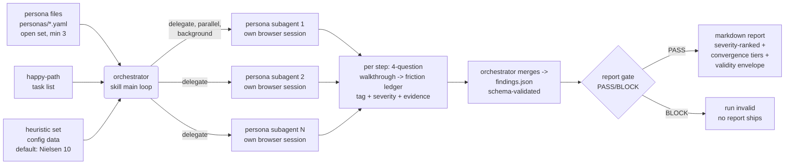

# Feature: ux-gauntlet MVP — persona-driven friction audit skill

## Summary

An MIT-licensed agent skill (Claude Code first, Codex-compatible where feasible) that runs an
**open, extensible set of personas** — 3 buyer-intent defaults shipped (free-tier user,
willing-to-pay user, VP/team buyer); minimum 3 per run for convergence reliability, no upper
bound; one data file = one persona — through an operator-supplied happy-path task list against a
live web app. **Each persona executes as an independent delegated subagent, in parallel, in the
background, with its own browser session.** Every extra action is recorded as a named friction
instance with evidence, tagged against exactly one criterion from the **configured heuristic set
(pluggable data; default: Nielsen 10)**, scored 0–4 via the NN/g 3-factor rubric (frequency,
impact, persistence) plus a separate market-impact flag. The orchestrator merges the per-persona
ledgers into a schema-validated JSON findings file from which a severity-ranked markdown report
is generated — always carrying the validity-envelope disclosure (simulated users find breakdowns;
they do not predict WTP, conversion, or population rates).

White space claimed (per decision brief §4): buyer-economic persona differentiation +
citable heuristic/severity methodology + installable SKILL.md packaging + CI dogfood loop.
No existing open tool combines these.

## Architecture of a run



## Scenarios (Gherkin)

```gherkin
Scenario: run refuses to start without a happy path          # F7 F8
  Given a target URL but no happy-path task list
  When the operator invokes the skill
  Then the skill refuses to start the crawl
  And it explains that the happy path is operator-defined in MVP

Scenario: an extra step becomes a named, evidenced friction  # F10 F11 F12 F14
  Given the free-tier persona pursuing task "sign up and reach the dashboard"
  And the happy path expects 4 steps
  When the app forces an email-verification detour of 2 extra actions
  Then the ledger records one friction instance naming the detour
  And the instance carries exactly one criterion tag from the configured heuristic set
  And a 0-4 severity score from the frequency-impact-persistence rubric
  And at least one evidence artifact (screenshot, DOM snippet, or click trace)

Scenario: a walkthrough "No" always becomes a friction        # F9 F33
  Given the persona answers "No" to the discoverability question at step 2
  When the step record is written
  Then a friction instance exists for step 2
  And a findings file containing a "No" answer with no matching friction fails the report gate

Scenario: a finding without evidence is dropped, not softened  # F15
  Given a finding whose evidence artifact reference is empty
  When the report is generated
  Then that finding is absent from both findings.json and the markdown report

Scenario: three personas produce convergence tiers            # F16 F17
  Given a standard audit run
  When it completes
  Then at least 3 personas have executed the same task list
  And every finding carries a convergence tier equal to the number of personas that flagged it

Scenario: every report carries the validity envelope          # F20 F21 F22
  Given any completed run
  When the markdown report is generated
  Then it contains the validity-envelope disclosure section
  And it contains no willingness-to-pay estimate
  And it contains no population-percentage extrapolation

Scenario: the gate blocks an untagged finding                 # F18 F23 F24
  Given a findings.json where one finding lacks a heuristic tag
  When the report gate script runs
  Then it exits nonzero and no report ships

Scenario: persona validator rejects a malformed persona       # F1 F5 F25
  Given a persona file missing the patience-threshold field
  When the persona validator runs
  Then it exits nonzero and names the missing field

Scenario: CI blocks only on new catastrophes                  # F26
  Given a committed baseline report and a new run with one new severity-4 finding
  When CI mode compares the run to the baseline
  Then the process exits nonzero
  And findings of severity 3 or below are reported as informational only
```

## Acceptance criteria (two-axis tags; IDs trace to .swe-spec/requirements.txt)

### CRITICAL items
- [CRITICAL][BLOCKS:critical] Personas load from structured data files conforming to the persona schema (goal statement, success criteria, budget-authority context, patience threshold in steps, forbidden-claim guardrails). Requirement ID: F1, F5.
- [CRITICAL][BLOCKS:critical] Live crawl of a real browser session against the operator-supplied target URL, consuming an operator-supplied happy-path task list; refuses to start without one. Requirement ID: F6, F7, F8.
- [CRITICAL][BLOCKS:high] Per-step 4-question cognitive-walkthrough record (right goal? element noticed? mapping understood? feedback seen?) before advancing — and a "No" answer to any question MUST produce a friction instance for that step (a logged "No" with no consequence is a gate violation). Requirement ID: F9, F33.
- [CRITICAL][BLOCKS:high] Friction accounting: one named friction instance per action beyond the happy path; exactly one criterion tag from the configured heuristic set (data-loaded; default: Nielsen 10); 0–4 severity from frequency-impact-persistence. Friction covers extra actions AND ambiguity resolutions the happy path does not require (pure cognitive-load-only friction is a logged MVP cut — see scrub log). Requirement ID: F10, F11, F12, F28, F34.
- [CRITICAL][BLOCKS:high] Evidence discipline: every friction instance references ≥1 captured artifact; zero-evidence findings are dropped. Requirement ID: F14, F15.
- [CRITICAL][BLOCKS:high] Reliability control: ≥3 personas per standard run; per-finding convergence tier = count of personas that flagged it. Requirement ID: F16, F17.
- [CRITICAL][BLOCKS:high] Primary output is schema-validated findings.json; markdown report is generated from it. Requirement ID: F18, F19.
- [CRITICAL][BLOCKS:low] Every report carries the validity-envelope disclosure with its 4 enumerated sub-disclosures (not a replacement for real user research; no WTP claims; no population-rate claims; no ISO-9241-11 compliance claim); the report never emits WTP estimates or population-percentage extrapolations. Requirement ID: F20, F21, F22, F35.

### HIGH items
- [HIGH][BLOCKS:high] Three default persona files ship: free-tier user, willing-to-pay user, VP/team buyer — the persona set is OPEN: one data file = one persona, zero skill-logic edits to add one. Requirement ID: F2, F3, F4, F29.
- [HIGH][BLOCKS:high] Execution model: each persona runs as an independent delegated subagent with its own browser session; persona subagents run in parallel as background tasks; the orchestrator merges all ledgers into the single findings file. Requirement ID: F30, F31, F32.
- [HIGH][BLOCKS:low] Market-impact flag stored separately from the severity score (cheap-fix/high-perception findings stay visible). Requirement ID: F13.
- [HIGH][BLOCKS:low] Deterministic gates: report gate exits nonzero on schema violation or untagged finding; persona validator exits nonzero on schema violation. Requirement ID: F23, F24, F25.
- [HIGH][BLOCKS:high] Runner CLI conforms to the contract in docs/adr/0001-runner-cli-contract.md (flags, exit codes, stderr refusal reasons). Requirement ID: F36.
- [HIGH][BLOCKS:none] Agent-skills packaging: SKILL.md with name+description frontmatter; body <500 lines; personas/schemas/templates as bundled resources (progressive disclosure). Requirement ID: N1, N2.

### MEDIUM items
- [MEDIUM][BLOCKS:none] CI mode: headless, non-interactive; exits nonzero only on a new severity-4 finding vs the committed baseline. Requirement ID: F26, N4.
- [MEDIUM][BLOCKS:none] Operator-allowlisted standardized flows (login, stock checkout) labeled lower-confidence in the report (cognitive walkthrough is weaker there). Requirement ID: F27.
- [MEDIUM][BLOCKS:none] 3-persona × 5-step run completes ≤45 min on one machine; localhost targets need no third-party service beyond the agent runtime. Requirement ID: N5, N6.

### LOW items (convergence tail)
- [LOW][BLOCKS:none] MIT license file present. Requirement ID: N3.
- [LOW][BLOCKS:none] All shipped artifacts in English. Requirement ID: N7.

## Non-goals (MVP)

- No WTP/dollar estimation, conversion prediction, or "% of users" claims (validity envelope, brief §3).
- No autonomous task/goal invention — happy path is operator-defined in v1.
- No accessibility audit (dedicated skill territory), no cross-browser/device matrix (desktop viewport only).
- No multi-run trend statistics in v1 (defer to v2 once baselines exist).
- No ISO 9241-11 "compliance score" — friction findings only.

## Decisions taken (reversible defaults; founder may override)

| # | Decision | Default chosen | Why |
|---|----------|----------------|-----|
| D1 | Persona count | Floor of 3 per run, NO ceiling; set open via data files; 3 buyer-intent defaults shipped | single-evaluator ratings unreliable (brief §2.4); founder: 3 was never a cap |
| D2 | Task-list authorship | Operator-supplied only | reproducibility; agent must not redefine the happy path |
| D3 | CI gate threshold | Block on new severity-4 only | advisory-first, avoids CI fatigue (brief §6) |
| D4 | Standardized-flow handling | Operator allowlist (no auto-detect); allowlisted flows keep FULL walkthrough scoring, only the confidence label is downgraded | auto-detection unproven; skip-scoring (brief §2.2 alternative) rejected for uniform data shape + cross-run comparability |
| D5 | Browser substrate | Playwright-based bundled scripts | CI-headless requirement (N4) + anthropics/skills precedent |
| D6 | Report tone | Maximum critique, zero flattery — but every claim evidence-anchored | founder intent, made defensible by F14/F15 |
| D7 | Heuristic taxonomy | Pluggable data file; default = Nielsen 10; alternative sets (ISO 9241-110, Bastien-Scapin, custom conversion-friction) loadable without logic edits; any custom set labeled as author's own choice, never source-attributed | founder: Nielsen is not the only lens; invariant is "no untagged finding", not "Nielsen" |
| D8 | Worker routing | Persona subagents run on Sonnet/Haiku-class workers, model stated explicitly per lane, never the session flagship | founder cost policy |
| D9 | Runner CLI contract | Flags + exit codes fixed in docs/adr/0001-runner-cli-contract.md; tests may only invoke that interface | a CLI is a public interface — decision-recorded, not test-invented (review finding #18) |
| D10 | convergence_tier representation | Integer count of flagging personas in findings.json; named buckets (flagged-by-1/2+/all) derived at render time only | one canonical representation; buckets are presentation (review finding #19) |

## Traceability

- Research: `docs/research/DECISION-BRIEF.md` (each methodology choice cites its source there).
- Requirements: `.swe-spec/requirements.txt` (34 lines, req-lint 34/34 PASS).
- RED acceptance test: `test/acceptance.test.mjs` (references every CRITICAL requirement ID; fails until built).
