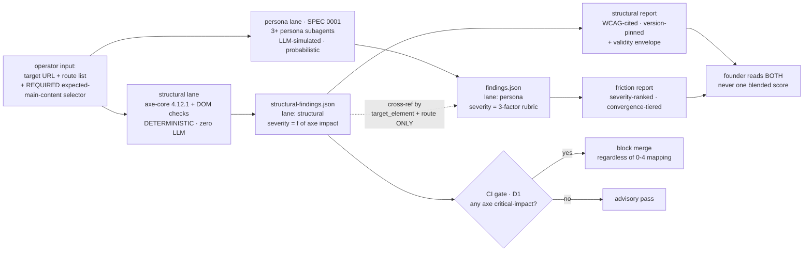

# Feature: ux-gauntlet SPEC 0002 — deterministic structural UI-quality lane

## Summary

A second audit lane for ux-gauntlet: **accessibility (WCAG via axe-core) + semantic structure +
main-content correctness + interactive-component correctness**, run alongside — never merged into —
the persona-friction lane of SPEC 0001. The two lanes answer different questions with different
epistemics and MUST stay separate artifacts (brief §1): the structural lane is **code-correctness**
(name/role/value exposed, contrast passes, landmarks sane, the operator's declared main content
actually inside `<main>`), judged by axe-core + deterministic DOM/CSS checks with **zero LLM
judgment**; the persona lane is **usability** for a buyer intent, judged by simulated personas.

The lane's entire value proposition is **reproducibility**: the same DOM snapshot + the same pinned
axe-core version (4.12.1) + the same ruleset configuration MUST yield a byte-identical violation-id
set on every run (brief §4). `severity` is a pure function of axe's own `impact` field, never a
persona/LLM judgment. Output is a schema-validated JSON findings file in the same schema family as
SPEC 0001, discriminated by a **mandatory `lane: "structural"` field** so no downstream tool can
conflate the two axes (D6). Every report carries a mandatory **validity envelope**: automated a11y
catches only ~32% of WCAG AA criteria by criteria-count (16 of 50) / ~57% by issue-volume
(vendor-reported), so a structural pass is not "usable" and not "good UI" (brief §3).

The working spike is `scripts/structural-scan.mjs`; this spec fixes the contract the built lane must
honor.

## Architecture of a run — two lanes, composed, never fused



The two lanes run **independently and in parallel with no cross-lane gating in the MVP** (D3): a
structural failure does NOT gate whether the persona lane runs, and vice versa. (The "structural as a
cheap pre-flight gate" idea from brief §6.3 is a v2 sequencing optimization, explicitly out of scope.)

## Scenarios (Gherkin)

```gherkin
Scenario: the lane refuses a gated result without an expected-main-content selector   # S13
  Given a target URL and a route but no operator-declared expected-main-content selector
  When the operator invokes the structural lane
  Then the lane refuses to produce a gated structural result
  And it explains that the expected-main-content selector is operator-declared and required

Scenario: axe-core is pinned and its version + ruleset are disclosed every run   # S1 S2 S3 S28
  Given the structural lane runs against a route
  When the report is produced
  Then the report metadata records axe-core version 4.12.1 verbatim
  And the metadata records the ruleset tags wcag2a, wcag2aa, wcag21aa, wcag22aa, best-practice

Scenario: name-role-value is checked for every interactive component   # S4 S16
  Given a page whose primary button exposes no accessible name
  When the lane runs the axe name-role-value ruleset
  Then a finding is recorded for the unnamed control
  And a custom widget whose aria-expanded state is invalid is likewise flagged
  And a plain link with no user-settable state is not flagged for a missing value

Scenario: contrast is computed with no rounding leniency   # S5
  Given body text whose foreground-to-background ratio is 4.499:1 at normal size
  When the lane runs axe color-contrast
  Then that text is flagged as failing the 4.5:1 normal-text minimum
  And a 3:1 threshold is applied instead only when the text is 18pt-plus, or 14pt-plus when bold

Scenario: exactly one main landmark, else the containment check fails closed   # S7 S12 S14
  Given a page that exposes two main landmarks
  When the lane evaluates expected-main-content containment
  Then the containment check reports cannot-evaluate-ambiguous-main
  And it never emits a false pass for the declared main content

Scenario: the declared main content must be found, inside main, and prominent   # S12
  Given an operator-declared expected-main-content selector
  When the lane resolves it against a page with exactly one main landmark
  Then the finding records whether the anchor is found on the page
  And whether it sits inside the single main landmark
  And whether it is the largest visible text block on the page

Scenario: heading-order is a best-practice label, never a WCAG failure   # S10 S27
  Given a page whose headings skip from h1 to h3
  When the lane records the heading-order finding
  Then the finding carries a best-practice label visibly distinct from WCAG success-criterion violations
  And the report never labels it a WCAG 1.3.1 failure

Scenario: severity is a pure function of axe impact   # S17 S19
  Given axe reports one critical-impact violation and one minor-impact violation
  When severity is assigned
  Then the critical-impact finding carries severity 4 and the minor-impact finding carries severity 1
  And no persona-derived or model-derived value enters the assignment

Scenario: an axe incomplete result is surfaced at severity 0, never dropped   # S18
  Given axe returns an incomplete ("needs manual review") result for one rule
  When the report is produced
  Then that result appears as a severity-0 needs-manual-review entry
  And it is never reported as a pass and never silently dropped

Scenario: determinism — same input, byte-identical violation-id set   # S21
  Given an identical DOM snapshot, axe-core 4.12.1, and an identical ruleset configuration
  When the lane runs twice
  Then the two runs emit a byte-identical violation-id set

Scenario: findings carry the mandatory structural lane discriminator   # S22 S23
  Given a completed structural run
  When the findings file is written
  Then every finding carries a lane field whose value is the string structural
  And the file is a separate artifact never merged with the persona findings into one blended score

Scenario: every report carries the validity envelope   # S25 S26 S29
  Given any completed structural run
  When the report is produced
  Then it states automated testing covers about 32 percent of WCAG AA criteria by criteria-count (16 of 50)
  And it names focus order, focus visible, and keyboard operability as non-automatable classes
  And it states that a structural pass is not a WCAG conformance certification

Scenario: CI blocks on any axe critical-impact violation   # S30
  Given a structural report containing one axe critical-impact violation
  When the CI gate runs
  Then it blocks the merge regardless of the 0-to-4 severity mapping

Scenario: a version bump is a decision-record event   # S32
  Given a proposal to move axe-core off the pinned 4.12.1
  When the change is prepared
  Then a decision record is required before the new version is used
```

## Acceptance criteria (two-axis tags; IDs trace to .swe-spec-0002/requirements.txt)

### CRITICAL items
- [CRITICAL][BLOCKS:critical] The structural lane injects the pinned axe-core script into each operator-supplied route's rendered DOM via Playwright and collects violations, incomplete results, and passes as structured data. Requirement ID: S1.
- [CRITICAL][BLOCKS:high] axe-core is pinned to the exact version 4.12.1, recorded verbatim in every report's metadata block. Requirement ID: S2.
- [CRITICAL][BLOCKS:high] The axe run is configured with ruleset tags wcag2a, wcag2aa, wcag21aa, wcag22aa, best-practice, recorded in report metadata. Requirement ID: S3.
- [CRITICAL][BLOCKS:critical] Name-role-value is checked for every interactive component via the axe rules button-name, link-name, input-button-name, select-name, aria-required-attr, aria-valid-attr-value; name+role always, value only where the component has user-settable state (brief §2a caveat, not smoothed over). Requirement ID: S4.
- [CRITICAL][BLOCKS:critical] Custom-widget ARIA state validity (aria-expanded, aria-selected, aria-checked) is checked via the axe ARIA-state ruleset. Requirement ID: S16.
- [CRITICAL][BLOCKS:high] Contrast is checked via axe color-contrast at 4.5:1 normal text, 3:1 large text (18pt-plus, or 14pt-plus bold), with no rounding (4.499:1 fails). Requirement ID: S5.
- [CRITICAL][BLOCKS:high] Form inputs are checked for a programmatic label via axe label, aria-input-field-name. Requirement ID: S6.
- [CRITICAL][BLOCKS:high] Exactly-one-main is enforced via axe landmark-one-main, reported as a best-practice rule at moderate impact, never dressed as a WCAG success criterion. Requirement ID: S7.
- [CRITICAL][BLOCKS:high] The operator-declared expected-main-content anchor is verified as found on the page, inside the single main landmark, and the largest visible text block. Requirement ID: S12.
- [CRITICAL][BLOCKS:high] When the page's main-landmark count is not exactly 1, the containment check fails closed with cannot-evaluate-ambiguous-main, never a false pass. Requirement ID: S14.
- [CRITICAL][BLOCKS:critical] The lane refuses to produce a gated structural result when no expected-main-content selector is supplied, mirroring SPEC 0001's happy-path refusal-to-start (D2). Requirement ID: S13.
- [CRITICAL][BLOCKS:high] Severity is a pure function of axe's own impact field: critical=4, serious=3, moderate=2, minor=1. Requirement ID: S17.
- [CRITICAL][BLOCKS:high] An axe incomplete result maps to severity 0, is always surfaced as needs-manual-review, and is never dropped or reported as a pass. Requirement ID: S18.
- [CRITICAL][BLOCKS:high] Severity is assigned with zero LLM judgment; no persona-derived or model-derived value enters the lane. Requirement ID: S19.
- [CRITICAL][BLOCKS:critical] Determinism invariant: identical DOM snapshot + pinned axe-core 4.12.1 + identical ruleset configuration yields a byte-identical violation-id set every run. Requirement ID: S21.
- [CRITICAL][BLOCKS:critical] Output is a schema-validated JSON findings file in the same findings-schema family as SPEC 0001, carrying a mandatory lane field whose value is the string structural (D6). Requirement ID: S22.
- [CRITICAL][BLOCKS:none] The structural findings file is never merged with the persona findings file into one blended score; it stays a separate artifact (brief §1, §3 — paramount to lane integrity even though it blocks nothing downstream). Requirement ID: S23.
- [CRITICAL][BLOCKS:low] Every report prints a validity envelope: automated a11y covers ~32 percent of WCAG AA criteria by criteria-count (16 of 50), ~57 percent by issue-volume (vendor-reported), so a structural pass is not usable and not good UI. Requirement ID: S25.
- [CRITICAL][BLOCKS:critical] The CI gate blocks a merge on any axe critical-impact violation, independent of the 0-to-4 severity mapping (D1 — deterministic, no persona-reliability discount). Requirement ID: S30.

### HIGH items
- [HIGH][BLOCKS:medium] Landmark roles are validated against the 8 WAI-ARIA landmark types (banner, navigation, main, search, form, region, complementary, contentinfo); an unlabeled section is flagged as a coverage gap, never silently skipped. Requirement ID: S9.
- [HIGH][BLOCKS:medium] Each flow step's declared continue control is verified as a semantic control, carrying an accessible name, keyboard-focusable. Requirement ID: S15.
- [HIGH][BLOCKS:low] Positive `tabindex` (value greater than 0) is flagged as an anti-pattern via a deterministic DOM check. Requirement ID: S11.
- [HIGH][BLOCKS:medium] Every report's metadata discloses the pinned axe-core version 4.12.1 plus the configured ruleset tags for that run. Requirement ID: S28.
- [HIGH][BLOCKS:low] A structural finding cross-references a persona finding only through the shared target_element identifier plus the shared run route, never through a merged severity value. Requirement ID: S24.
- [HIGH][BLOCKS:low] The WCAG target level is configurable, defaulting to AA, swappable through configuration data without editing lane logic (D4). Requirement ID: S31.
- [HIGH][BLOCKS:medium] Any bump of the pinned axe-core version requires a recorded decision record before the new version is used (D5). Requirement ID: S32.
- [HIGH][BLOCKS:none] The structural lane runs independently of the persona lane with no cross-lane gating in the MVP (D3). Requirement ID: S34.
- [HIGH][BLOCKS:none] The lane reproduces the same finding set across repeated runs on the same DOM snapshot under the same pinned version, with no run-to-run sampling variance. Requirement ID: SN1.

### MEDIUM items
- [MEDIUM][BLOCKS:high] Two findings sharing the same axe rule ID plus the same target-element selector are deduplicated into one finding entry. Requirement ID: S20.
- [MEDIUM][BLOCKS:low] Region-containment is checked via axe region to flag content sitting outside every landmark. Requirement ID: S8.
- [MEDIUM][BLOCKS:low] Heading-order findings are reported under a best-practice label visibly distinct from WCAG success-criterion violations, never as a WCAG 1.3.1 failure. Requirement ID: S10.
- [MEDIUM][BLOCKS:low] The validity envelope names the WCAG classes automated testing cannot evaluate (at minimum focus order, focus visible, keyboard operability). Requirement ID: S26.
- [MEDIUM][BLOCKS:low] The validity envelope labels heading-order and DOM-order findings as best-practice heuristics, never as WCAG success-criterion violations. Requirement ID: S27.
- [MEDIUM][BLOCKS:low] Every report states that a structural pass is not a WCAG conformance certification. Requirement ID: S29.
- [MEDIUM][BLOCKS:none] The lane audits only the operator-supplied route list per run; no site-wide crawl, no autonomous route discovery. Requirement ID: S33.
- [MEDIUM][BLOCKS:low] The findings JSON conforms to a versioned schema carrying a schema_version integer the gate checks before accepting the file. Requirement ID: SN2.
- [MEDIUM][BLOCKS:none] The lane depends on no third-party network service beyond the local browser runtime for a localhost route. Requirement ID: SN3.
- [MEDIUM][BLOCKS:none] Each route is rendered at a single pinned desktop viewport of 1280px width. Requirement ID: SN4.
- [MEDIUM][BLOCKS:low] Report metadata records the run timestamp, pinned axe-core version, ruleset tags, and WCAG target level as machine-readable fields. Requirement ID: SN6.

### LOW items (convergence tail)
- [LOW][BLOCKS:none] All shipped structural-lane artifacts are MIT-licensed and authored in English. Requirement ID: SN5.

## Non-goals (MVP)

- **No focus-order / focus-visible gating** — 0% automatable per Deque's own criteria-level data (brief §3, [4]); disclosed in the validity envelope as a manual-testing gap, never a pass/fail gate.
- **No keyboard-trap / full keyboard-operability testing** — same 0%-automatable rationale.
- **No Readability-style auto-detected main-content fallback** — MVP requires an operator-declared selector for a CRITICAL-gated result (D2); the inferential fallback is a v2 advisory-only feature (brief §2c/§5).
- **No DOM-vs-visual reading-order check** — heuristic, judgment-heavy; deferred to v2 (brief §2b/§5).
- **No multi-route / site-wide crawl** — single operator-supplied route list per run (brief §5).
- **No merging structural + persona severities into one "UX score"** — two separate artifacts, cross-referenced by run route + target_element, never algebraically combined (brief §1/§3).
- **No WCAG AAA criteria in the MVP gate** — AAA is advisory-only, later (brief §5).
- **No structural-as-pre-flight-gate for the persona lane** — the cheap-gate sequencing (brief §6.3) is a v2 optimization; MVP lanes are independent (D3).
- **No "simplify to pass/fail" report mode** that would hide the `incomplete` / needs-manual-review distinction (brief §5).

## Known verification gaps (MVP)

- **The RED acceptance test is fixture/contract-shaped, not live-browser end-to-end.** Like SPEC 0001's disclosed gap, no test in this suite drives a real Playwright browser against a live target to prove axe injection, contrast extraction, or the determinism invariant end-to-end; the tests assert the schema contract, gate behavior, and report-surface obligations. A dedicated Playwright-driven suite against a minimal local fixture server is a named v2 residual.
- **The determinism invariant (S21) is asserted as a gate-checked contract over a recorded violation-id set, not proven by two live consecutive browser runs.** Live double-run proof is deferred to the same v2 suite.
- **axe-core's own coverage figures (~32%/~57%) are vendor-reported** (Deque, the maker of axe-core), not independently audited — disclosed verbatim in the validity envelope (brief §3), the more conservative criteria-count figure (~32%, 16/50) reported alongside the volume-weighted one.

## Decisions taken (reversible defaults; founder may override)

| # | Decision | Default chosen | Why (reversible) |
|---|----------|----------------|------------------|
| D1 | CI gate strictness | **Any axe critical-impact violation blocks the merge, independent of the 0-4 mapping** — a stricter bar than SPEC 0001's severity-4-only gate | deterministic checks carry no persona-reliability discount, so a critical-impact axe violation is a hard, reproducible fact worth blocking on (brief §6.1). Reversible: founder may relax to the SPEC 0001 severity-4 parity bar |
| D2 | Expected-main-content requirement | **Require an operator-declared selector; refuse to run a gated result without one** | mirrors SPEC 0001's happy-path refusal-to-start; keeps the main-content check a pure deterministic containment test rather than an inferential Readability guess (brief §2c/§6.2). Reversible: founder may ship the low-confidence Readability fallback in MVP instead |
| D3 | Lane sequencing | **Structural + persona lanes independent/parallel, NO cross-lane gating in MVP** | the cheap-pre-flight-gate optimization (brief §6.3) is a v2 concern; MVP keeps the two axes composable but non-coupled so a structural failure cannot silently suppress persona findings. Reversible: v2 may add the structural pre-flight gate |
| D4 | WCAG target level | **AA, pluggable/configurable via data** (default AA) | AA is the industry/jurisdiction baseline (brief §6.4); made swappable the same way SPEC 0001 makes the heuristic set pluggable, so a stricter/looser target needs no logic edit. Reversible by config |
| D5 | axe-core version-pin policy | **Pin exact version 4.12.1; a bump requires a decision record** | a version bump can silently add/retire rules or reclassify impact levels under a report a founder assumes is stable (brief §4), defeating the lane's reproducibility promise. Reversible: founder may adopt a semver-range with a report-metadata diff trail |
| D6 | Schema family | **Same findings-schema family as SPEC 0001, discriminated by a mandatory `lane:"structural"` field; one CI diff handles both** | one schema family + one diff script keeps the two lanes reportable side by side while the `lane` discriminator makes accidental fusion structurally impossible (brief §6.6). Reversible: founder may split into a fully separate schema/gate |

## Traceability

- Research: `docs/research/DECISION-BRIEF-0002-STRUCTURAL.md` (§2 MUST-checks, §4 severity+determinism, §5 MVP scope + non-goals, §6 open decisions D1-D6, §7 20 sources). Each check cites its WCAG SC / axe rule / source there.
- Composition parent: `docs/specs/0001-ux-gauntlet-mvp.spec.md` (the persona-friction lane; SPEC 0001 §7 non-goals explicitly deferred this accessibility/structural scope to a dedicated lane — this spec is that lane). The two lanes are cross-referenced by `target_element` + run route only, never fused (brief §1).
- Spike: `scripts/structural-scan.mjs` (the working shape the built lane extends: axe injection, landmark/heading/main-content/affordance checks, mechanical severity mapping).
- Requirements: `.swe-spec-0002/requirements.txt` (40 lines: 34 functional S1-S34, 6 nonfunctional SN1-SN6; req-lint 40/40 PASS — see `.swe-spec-0002/lint-result.txt`).
- RED acceptance test: `test/acceptance-0002.test.mjs` (references every CRITICAL requirement ID with non-constant behavioral assertions; fails until the structural lane, its schema, gate, renderer, and CI diff are built).
- Founder decisions D1-D6 resolved and encoded above, each marked reversible.
