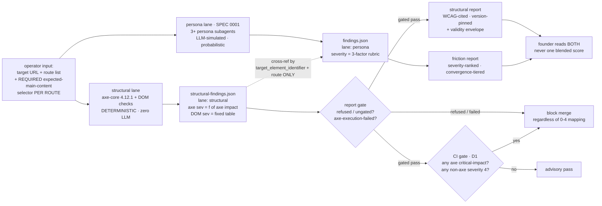

# Feature: ux-gauntlet SPEC 0002 — deterministic structural UI-quality lane

## Summary

A second audit lane for ux-gauntlet: **accessibility (WCAG via axe-core) + semantic structure +
main-content correctness + interactive-component correctness**, run alongside — never merged into —
the persona-friction lane of SPEC 0001. The two lanes answer different questions with different
epistemics and MUST stay separate artifacts (brief §1): the structural lane is **code-correctness**
(name/role/value exposed, contrast passes, landmarks sane, the operator's declared main content
actually inside `<main>`), judged by axe-core + deterministic DOM/CSS checks with **zero LLM
judgment**; the persona lane is **usability** for a buyer intent, judged by simulated personas.

The lane's entire value proposition is **reproducibility**: once the S1 settle precondition
(page load + `document.fonts.ready` + a 500ms MutationObserver DOM-mutation quiescence window, capped
at a fixed 10s maximum wait — S1/CR2-B4/CR2-B18) has completed, the same DOM snapshot + the same pinned
axe-core version (4.12.1) + the same ruleset configuration MUST yield a byte-identical finding-id set
— spanning both the axe violation results and the axe incomplete results (S21) — on every run
(brief §4), and the non-axe custom-check finding-id set is held to the same byte-identical-across-runs
bar (S42). Each axe-violation `severity` is a pure function of axe's own `impact` field (S17); each
non-axe DOM-check carries a fixed, spec-pinned severity constant (S35); an axe `incomplete`-derived
finding is always severity 0, that assignment taking precedence over any impact value on the entry
(S18/S36) — never a persona/LLM judgment (S19). Output is a schema-validated JSON findings file in the
same schema family as SPEC 0001, discriminated by a **mandatory `lane: "structural"` field** so no
downstream tool can conflate the two axes (D6). Every report carries a mandatory **validity
envelope**: automated a11y catches only ~32% of WCAG AA criteria by criteria-count (16 of 50) / ~57%
by issue-volume — **both figures vendor-reported by Deque, not independently audited** (S25) — so a
structural pass is not "usable" and not "good UI" (brief §3).

The working spike is `scripts/structural-scan.mjs`; this spec fixes the contract the built lane must
honor.

## Architecture of a run — two lanes, composed, never fused



The two lanes run **independently and in parallel with no cross-lane gating in the MVP** (D3): a
structural failure does NOT gate whether the persona lane runs, and vice versa. (The "structural as a
cheap pre-flight gate" idea from brief §6.3 is a v2 sequencing optimization, explicitly out of scope.)

## Scenarios (Gherkin)

```gherkin
Scenario: the lane refuses a gated result without an expected-main-content selector   # S13
  Given a target URL and a route but no operator-declared expected-main-content selector
  When the operator invokes the structural lane
  Then the lane refuses to produce a gated structural result
  And it explains that the expected-main-content selector is operator-declared and required

Scenario: axe-core is pinned and its version + ruleset are disclosed every run   # S1 S2 S3 S28
  Given the structural lane runs against a route
  When the report is produced
  Then the report metadata records axe-core version 4.12.1 verbatim
  And the metadata records the ruleset tags wcag2a, wcag2aa, wcag21aa, wcag22aa, best-practice

Scenario: name-role-value is checked for every interactive component   # S4 S16
  Given a page whose primary button exposes no accessible name
  When the lane runs the axe name-role-value ruleset
  Then a finding is recorded for the unnamed control
  And a custom widget whose aria-expanded state is invalid is likewise flagged
  And a plain link with no user-settable state is not flagged for a missing value

Scenario: contrast is computed with no rounding leniency   # S5
  Given body text whose foreground-to-background ratio is 4.499:1 at normal size
  When the lane runs axe color-contrast
  Then that text is flagged as failing the 4.5:1 normal-text minimum
  And a 3:1 threshold is applied instead only when the text is 18pt-plus, or 14pt-plus when bold

Scenario: exactly one main landmark, else the containment check fails closed   # S7 S12 S14
  Given a page that exposes two main landmarks
  When the lane evaluates expected-main-content containment
  Then the containment check reports cannot-evaluate-ambiguous-main
  And it never emits a false pass for the declared main content

Scenario: the declared main content must be found, inside main, and prominent   # S12
  Given an operator-declared expected-main-content selector
  When the lane resolves it against a page with exactly one main landmark
  Then the finding records whether the anchor is found on the page
  And whether it sits inside the single main landmark
  And whether it is the largest visible text block on the page by rendered bounding-box area (width times height, not character count), ties broken by DOM order

Scenario: heading-order is a best-practice label, never a WCAG failure   # S10 S27
  Given a page whose headings skip from h1 to h3
  When the lane records the heading-order finding
  Then the finding carries a best-practice label visibly distinct from WCAG success-criterion violations
  And the report never labels it a WCAG 1.3.1 failure

Scenario: axe-violation severity is a pure function of axe impact   # S17 S19
  Given axe reports one critical-impact violation and one minor-impact violation
  When severity is assigned to those axe-violation findings
  Then the critical-impact finding carries severity 4 and the minor-impact finding carries severity 1
  And no persona-derived or model-derived value enters the assignment

Scenario: each non-axe DOM-check finding carries its fixed spec-pinned severity   # S35
  Given the lane emits a main-content-missing finding and a positive-tabindex finding
  When severity is assigned to those non-axe DOM-check findings
  Then main-content-missing carries the pinned severity 4 and positive-tabindex carries the pinned severity 1
  And the severity comes from the S35 spec-pinned table, never from an axe impact value it does not have

Scenario: an axe incomplete result is surfaced at severity 0, never dropped   # S18 S36
  Given axe returns an incomplete ("needs manual review") result whose entry also carries impact critical
  When the report is produced
  Then that result appears as a severity-0 needs-manual-review entry
  And the severity-0 assignment takes precedence over the critical impact value on the incomplete entry
  And it is never reported as a pass and never silently dropped

Scenario: determinism — same input, byte-identical violation-id set   # S21
  Given an identical DOM snapshot, axe-core 4.12.1, and an identical ruleset configuration
  When the lane runs twice
  Then the two runs emit a byte-identical violation-id set

Scenario: findings carry the mandatory structural lane discriminator   # S22 S23
  Given a completed structural run
  When the findings file is written
  Then every finding carries a lane field whose value is the string structural
  And the file is a separate artifact never merged with the persona findings into one blended score

Scenario: every report carries the validity envelope   # S25 S26 S29
  Given any completed structural run
  When the report is produced
  Then it states automated testing covers about 32 percent of WCAG AA criteria by criteria-count (16 of 50)
  And it names focus order, focus visible, and keyboard operability as non-automatable classes
  And it states that a structural pass is not usable and is not good UI
  And it states that a structural pass is not a WCAG conformance certification

Scenario: CI blocks on any axe critical-impact violation   # S30
  Given a structural report containing one axe critical-impact violation
  When the CI gate runs
  Then it blocks the merge regardless of the 0-to-4 severity mapping

Scenario: CI blocks a run-level refused or ungated report before scoring   # S13 S37
  Given a structural findings file whose run carries a refused status because the expected-main-content selector was missing
  When the CI gate runs
  Then it blocks the merge on the refused run-level status alone
  And it does not report an advisory pass just because the file holds zero axe critical-impact violations

Scenario: CI blocks a non-axe severity-4 finding   # S38
  Given a structural report whose only severity-4 finding is a non-axe main-content-missing DOM check
  When the CI gate runs
  Then it blocks the merge on that non-axe severity-4 finding
  And it does so independently of the axe critical-impact predicate

Scenario: CI blocks when axe itself failed to complete on a route   # S45 S46
  Given a structural findings file where one route records run_status axe-execution-failed
  When the CI gate runs
  Then it blocks the merge because that route was never actually tested
  And a genuinely clean completed run with zero violations still passes the CI gate

Scenario: a version bump is a decision-record event   # S32
  Given a proposal to move axe-core off the pinned 4.12.1
  When the change is prepared
  Then a decision record is required before the new version is used

Scenario: CI blocks a route whose settle precondition never resolved   # S47 S48
  Given a route whose page keeps mutating past the fixed 10-second settle cap
  When the lane records that route's run_status as settle-timeout
  Then the CI gate blocks the merge on the settle-timeout status
  And that route is never reported as a silent zero-violations clean pass

Scenario: CI blocks a critical-impact result that axe classified as incomplete   # S53 D7
  Given an axe incomplete result whose underlying impact field is critical
  When the report surfaces it at the pinned severity-0 needs-manual-review display value
  Then the CI gate still blocks the merge by reading the raw critical impact field
  And the severity-0 display value is preserved for the human reviewer

Scenario: the CI critical-impact predicate reads raw impact, never the derived severity   # S52
  Given an axe-sourced finding whose impact is critical but whose severity integer was mis-mapped to 3
  When the CI gate evaluates the critical-impact block predicate
  Then it blocks the merge from the raw impact field, not the derived severity integer
```

## Acceptance criteria (two-axis tags; IDs trace to .swe-spec-0002/requirements.txt)

### CRITICAL items
- [CRITICAL][BLOCKS:critical] After the S1 settle precondition (page load + `document.fonts.ready` + a 500ms MutationObserver DOM-mutation quiescence window + `document.getAnimations({subtree:true})` holding no still-running *finite-iteration* animation — an animation whose `effect.getComputedTiming().iterations` is `Infinity` is treated as settled and never blocks the precondition, so a page with a legitimate infinite CSS animation (spinner, pulse, animated gradient) does not deadlock at the 10s cap — **plus an image-readiness gate: every `` and every element resolving a CSS `background-image` reachable from the rendered DOM must reach a decoded/complete state (`await img.decode()` + a computed-style `background-image` load check) before axe injection, so a paint-only image decode — invisible to the MutationObserver — cannot straddle axe injection and flip axe color-contrast between `incomplete` and pass on byte-identical DOM (CR5-B2)** — the whole precondition still capped at a fixed 10s max wait, an unmet image-readiness gate falling into `settle-timeout` like any other unmet precondition), the structural lane injects the pinned axe-core script (configured `rules { tabindex: { enabled: false } }`) into each operator-supplied route's rendered DOM via Playwright and collects violations, incomplete results, and passes as structured data. Requirement ID: S1.
- [CRITICAL][BLOCKS:high] axe-core is pinned to the exact version 4.12.1, recorded verbatim in every report's metadata block. Requirement ID: S2.
- [CRITICAL][BLOCKS:high] The axe run is configured with ruleset tags wcag2a, wcag2aa, wcag21aa, wcag22aa, best-practice, recorded in report metadata. Requirement ID: S3.
- [CRITICAL][BLOCKS:critical] Name-role-value is checked for every interactive component via the axe rules button-name, link-name, input-button-name, select-name, aria-required-attr, aria-valid-attr-value, aria-command-name; name+role always, value only where the component has user-settable state (brief §2a caveat, not smoothed over). Requirement ID: S4.
- [CRITICAL][BLOCKS:critical] Custom-widget ARIA state validity (aria-expanded, aria-selected, aria-checked) is checked via the axe ARIA-state ruleset. Requirement ID: S16.
- [CRITICAL][BLOCKS:high] Contrast is checked via axe color-contrast at 4.5:1 normal text, 3:1 large text (18pt-plus, or 14pt-plus bold), with no rounding (4.499:1 fails). Requirement ID: S5.
- [CRITICAL][BLOCKS:high] Form inputs are checked for a programmatic label via axe label, aria-input-field-name. Requirement ID: S6.
- [CRITICAL][BLOCKS:high] Exactly-one-main is enforced via axe landmark-one-main, reported as a best-practice rule at moderate impact, never dressed as a WCAG success criterion. Requirement ID: S7.
- [CRITICAL][BLOCKS:high] The operator-declared expected-main-content anchor is verified as found on the page, inside the single main landmark, and the largest visible text block by rendered bounding-box area — measured over the candidate set `main, article, section, div, p, h1`, excluding from the comparison pool **every candidate that is an ancestor of the declared anchor AND every candidate that is a descendant of the declared anchor** (so the anchor is never disqualified by a candidate that contains it, nor by a larger-bounding-box candidate it contains — e.g. an absolutely-positioned full-bleed overlay `div` nested inside the anchor), any candidate whose computed style resolves `display:none` / `visibility:hidden` / zero bounding-box area, and any candidate whose own rendered text content (`element.innerText`, trimmed) is zero-length (a decorative full-bleed container cannot outrank the real text anchor), ties broken by DOM order. Containment inside `<main>` does not imply equal-or-greater prominence; exclusion of the anchor's ancestors AND descendants — not a separate override clause — is what delivers "never disqualified by a candidate it contains" (CR2-M6 / CR3-B3 / CR4-B1 / CR4-B2 / CR4-M3). Requirement ID: S12.
- [CRITICAL][BLOCKS:high] When the page's main-landmark count is not exactly 1, the containment check fails closed with cannot-evaluate-ambiguous-main, never a false pass, this failure suppressing the entire S12 evaluation so no main-content-missing (nor any other S12-derived) finding is emitted for that page. Requirement ID: S14.
- [CRITICAL][BLOCKS:critical] The lane refuses to produce a gated structural result when no expected-main-content selector is supplied, mirroring SPEC 0001's happy-path refusal-to-start (D2). Requirement ID: S13.
- [CRITICAL][BLOCKS:high] Each axe-violation finding's severity is a pure function of axe's own impact field: critical=4, serious=3, moderate=2, minor=1 (scoped to axe violation results only — non-axe checks use S35, incomplete results use S36). Requirement ID: S17.
- [CRITICAL][BLOCKS:high] Each non-axe DOM-check finding carries a fixed spec-pinned severity keyed by finding code (main-content-missing=4, continue-control-missing=4, main-content-not-in-main=3, cannot-evaluate-ambiguous-main=3, continue-not-semantic=3, continue-not-focusable=3, main-content-not-prominent=2, unlabeled-landmark-section=2, positive-tabindex=1) — resolving the S17 fault-line where DOM checks carry no axe impact value. Requirement ID: S35.
- [CRITICAL][BLOCKS:high] An axe incomplete-derived finding is always severity 0, that assignment taking precedence over any impact value present on the incomplete entry. Requirement ID: S36.
- [CRITICAL][BLOCKS:high] An axe incomplete result maps to severity 0, is always surfaced as needs-manual-review, and is never dropped or reported as a pass. Requirement ID: S18.
- [CRITICAL][BLOCKS:high] Severity is assigned with zero LLM judgment; no persona-derived or model-derived value enters the lane. Requirement ID: S19.
- [CRITICAL][BLOCKS:critical] Determinism invariant: identical DOM snapshot + pinned axe-core 4.12.1 + identical ruleset configuration + identical pinned browser version + matching `render_environment_id` yields a byte-identical finding record set every run — each record spanning `finding_id`, `severity`, result-type, **and `impact`** (impact is in the covered set because for `incomplete` results S36 pins `severity` to the constant 0, so `impact` is the *sole* field the S53/D7 CI-block predicate reads; without it S21 could hold while `impact` drifts critical↔moderate on a stable `finding_id`, flipping the merge outcome, CR5-B5) — scoped, like sibling S42, to apply only when `render_environment_id` matches across runs, since D5b's own font-rendering rationale (a font/rendering change flipping a borderline 4.499:1 color-contrast finding) targets S21's axe-violation payload, not only S42's (CR4-M2 / CR4-M4). Requirement ID: S21.
- [CRITICAL][BLOCKS:critical] Output is a schema-validated JSON findings file in the same findings-schema family as SPEC 0001, carrying a mandatory lane field whose value is the string structural (D6). Requirement ID: S22.
- [CRITICAL][BLOCKS:none] The structural findings file is never merged with the persona findings file into one blended score; it stays a separate artifact (brief §1, §3 — paramount to lane integrity even though it blocks nothing downstream). Requirement ID: S23.
- [CRITICAL][BLOCKS:low] Every report prints a validity envelope stating that both the criteria-count figure (~32 percent, 16 of 50) and the issue-volume figure (~57 percent) are vendor-reported by Deque and not independently audited, so a structural pass is not usable and not good UI. Requirement ID: S25.
- [CRITICAL][BLOCKS:critical] Determinism invariant, non-axe axis: identical DOM snapshot + pinned axe-core 4.12.1 + pinned browser version + **matching `render_environment_id`** yields a byte-identical non-axe custom-check finding-id set every run — **textually symmetric with sibling S21, scoped to apply only when `render_environment_id` matches across runs (CR5-B1/CR5-B3: S42 is S21's non-axe twin and governs the S12 largest-block tie-break SN8 says host-OS glyph shaping can flip cross-machine; the CR4 pass scoped S21 but missed S42, so a builder implementing S42 literally shipped an unscoped cross-environment claim SN8's own mechanism falsifies)**. Requirement ID: S42.
- [CRITICAL][BLOCKS:critical] The CI gate blocks a merge on any axe critical-impact violation, independent of the 0-to-4 severity mapping (D1 — deterministic, no persona-reliability discount). Requirement ID: S30.
- [CRITICAL][BLOCKS:critical] The CI gate blocks a merge whenever the findings file carries a run-level refused status (S13), independent of the critical-impact predicate, so the report gate precedes the CI diamond and a refused run can never advisory-pass on zero critical violations. Requirement ID: S37.
- [CRITICAL][BLOCKS:critical] The CI gate blocks a merge whenever any non-axe DOM-check finding carries the code `main-content-missing` or `continue-control-missing`, **read from the persisted finding `code` directly, never from the derived `severity` integer** — so a corrupted S35 code→severity lookup (e.g. `main-content-missing` mis-mapped to 3) cannot silently defeat the block, matching the raw-field reads of sibling S52 (raw axe `impact`) and S56 (`code`) in the same predicate table (CR5-B6). Requirement ID: S38.
- [CRITICAL][BLOCKS:high] The lane records run_status axe-execution-failed for any route where the axe run fails to complete, never emitting a silent zero-violations clean pass for an untested route. Requirement ID: S45.
- [CRITICAL][BLOCKS:critical] The CI gate blocks a merge whenever any route's run_status is axe-execution-failed. Requirement ID: S46.
- [CRITICAL][BLOCKS:high] The lane records run_status settle-timeout for any route where the S1 settle precondition (page load + fonts.ready + 500ms DOM-mutation quiescence) does not complete within its fixed 10-second maximum wait, so a route on which the settle window never resolves is never reported as a silent clean pass. Requirement ID: S47.
- [CRITICAL][BLOCKS:critical] The CI gate blocks a merge whenever any route's run_status is settle-timeout. Requirement ID: S48.
- [CRITICAL][BLOCKS:critical] Determinism derivation: finding_id is a pure deterministic function of the route + the axe rule ID / non-axe finding code + the `target_element_identifier` only (the same literal schema field S20/S24/S41 key on, per CR4-M7), excluding any run-timestamp, random value, or DOM-node-reference component, so the byte-identical-set promise (S21/S42/SN1) cannot be satisfied by luck (e.g. crypto.randomUUID()). Requirement ID: S50.
- [CRITICAL][BLOCKS:critical] The structural-ci-diff.mjs CI gate evaluates the S30 critical-impact block predicate against each axe-sourced finding's raw impact field, never against its derived severity integer, so a latent bug in the S17 severity mapping cannot hide a critical-impact violation from the gate. Requirement ID: S52.
- [CRITICAL][BLOCKS:critical] The CI gate blocks a merge whenever any axe incomplete finding's underlying impact field is critical, independent of the S18/S36 severity-0 display value, so a reproducible critical a11y gap that axe classifies as incomplete cannot pass CI clean forever (D7). Requirement ID: S53.
- [CRITICAL][BLOCKS:critical] The CI gate blocks a merge whenever any audited route's findings carry the S40 route-level refused status (a route present in the run but missing from the expected-main-content map), so a route can never go silently unaudited while CI passes clean. Requirement ID: S54.
- [CRITICAL][BLOCKS:critical] The CI gate blocks a merge whenever any non-axe DOM-check finding carries the fail-closed code cannot-evaluate-ambiguous-main — the lane could not evaluate main-content containment (main-landmark count != 1), so the result is unmergeable like a refused run despite its pinned severity 3, closing the CR3-B1 hole where an advisory severity-3 ambiguous-main merged clean while a narrower severity-4 main-content-missing blocked. Requirement ID: S56.
- [CRITICAL][BLOCKS:critical] `structural-ci-diff.mjs` independently validates its own trust boundary before any route-level predicate: it refuses with a non-zero exit any input findings file whose `metadata.axe_version` is not the pinned 4.12.1 (S2), whose `schema_version` is not the supported value (SN2), or whose top-level `lane` is not the string `structural` (S22) — so a CI pipeline invoking only the diff gate cannot merge-evaluate an unpinned/misrouted bundle that only `structural-report-gate.mjs` would otherwise have caught (CR4-B5). Requirement ID: S57.
- [CRITICAL][BLOCKS:high] The lane records run_status axe-execution-degraded for any route where `axe.run()` resolves but the combined count of violation + incomplete + pass results is zero on a route whose pre-injection DOM snapshot was non-trivial — **"non-trivial" is the closed selector union, stated inline as the sole source of truth so no builder discretion remains (CR5-M4): `a[href], button, input, select, textarea, [role=button], [role=link], [role=switch], [role=checkbox], [role=radio], [role=tab], [role=menuitem], [role=combobox], [role=slider], [role=textbox]`, or one of S9's 8 landmark roles (`banner, navigation, main, search, form, region, complementary, contentinfo`), or `h1`–`h6`** — catching axe degrading silently (CSP-blocked internal checks, closed shadow roots) rather than throwing — the resolve-path twin of S45's throw-path fail-closed (CR4-M8). Requirement ID: S58.
- [CRITICAL][BLOCKS:critical] The CI gate blocks a merge whenever any route's run_status is axe-execution-degraded, so a silently-degraded axe run cannot advisory-pass clean (CR4-M8). Requirement ID: S59.

### HIGH items
- [HIGH][BLOCKS:medium] The lane scans every `section` and every `[role=region]` element for a missing accessible name (`aria-label`/`aria-labelledby`/`title`) and flags each as `unlabeled-landmark-section`, **independent of whether the accessibility tree ever assigned that element a landmark role** — an unlabeled `section` computes implicit role `generic` and is never exposed as a landmark, so the check is the accessible-name scan, not a role-membership test (CR5-M1: the earlier "validate each landmark role is one of 8 types" clause was untestable dead text — an unlabeled section never acquires a landmark role to validate). The 8 recognized WAI-ARIA landmark types (banner, navigation, main, search, form, region, complementary, contentinfo) remain the enumerated reference set (also the source for S58's landmark subset). Requirement ID: S9.
- [HIGH][BLOCKS:medium] Each **audited route's** single declared continue control is verified as a semantic control and keyboard-focusable, its accessible name taken from the S49 axe accname result rather than an independent, cruder name computation. **"Flow step" for the structural lane is synonymous with one route in the `--path` list (S39/S33): one continue-control expectation per route — the lane has no per-step injection surface, so a same-route multi-step wizard declares one continue control per route (CR5-M2, closing the SPEC-0001-borrowed "flow step" term that had no operational unit here).** The spike's `continue-no-name` DOM check (`structural-scan.mjs` `hasAccessibleName`) is **retired**: the continue-control accessible-name failure mode is covered exclusively by this S49 axe-accname-sourced check, never by a separate non-axe finding code (CR5-B4). Requirement ID: S15.
- [HIGH][BLOCKS:low] Positive `tabindex` (value greater than 0) is flagged as an anti-pattern via a deterministic DOM check. Requirement ID: S11.
- [HIGH][BLOCKS:medium] Every report's metadata discloses the pinned axe-core version 4.12.1 plus the configured ruleset tags for that run. Requirement ID: S28.
- [HIGH][BLOCKS:low] A structural finding cross-references a persona finding only through the shared `target_element_identifier` field (the field name that actually exists in the SPEC 0001 schema, not the non-existent `target_element`) plus the shared run `route` field, never through a merged severity value. Requirement ID: S24.
- [HIGH][BLOCKS:medium] The expected-main-content configuration is a route-to-selector map, one selector entry per audited route, keyed by exact case-sensitive match against the `--path` argument verbatim with no trailing-slash and no query-string normalization. Requirement ID: S39.
- [HIGH][BLOCKS:medium] The lane refuses a gated result for any audited route whose expected-main-content map carries no matching selector entry. Requirement ID: S40.
- [HIGH][BLOCKS:low] The WCAG target level is configurable, defaulting to AA, swappable through configuration data without editing lane logic (D4). Requirement ID: S31.
- [HIGH][BLOCKS:medium] Any bump of the pinned axe-core version requires a recorded decision record before the new version is used (D5). Requirement ID: S32.
- [HIGH][BLOCKS:medium] Any bump of the pinned Playwright browser binary version requires a recorded decision record before the new version is used. Requirement ID: S43.
- [HIGH][BLOCKS:none] The structural lane runs independently of the persona lane with no cross-lane gating in the MVP (D3). Requirement ID: S34.
- [HIGH][BLOCKS:none] The lane reproduces the same finding set across repeated runs on the same DOM snapshot under the same pinned version, with no run-to-run variance from DOM-node-reference instability. Requirement ID: SN1.
- [HIGH][BLOCKS:medium] The report metadata records the pinned Playwright browser binary version as a machine-readable field. Requirement ID: SN7.
- [HIGH][BLOCKS:medium] The accessible-name string S15 requires is computed via axe-core's exposed accname engine axe.commons.text.accessibleText on the same pinned axe-core 4.12.1 build used for S4's rule checks (which now includes aria-command-name so role-based controls have a name source), invoked inside an `axe.setup(document)` / `axe.teardown()` lifecycle bracket so `accessibleText` resolves against a live element — never a separate/independent name computation, so S15 sources a real resolved name rather than reaching into axe internals or building a second accname engine. Requirement ID: S49.
- [HIGH][BLOCKS:low] The S21/S42/SN1 acceptance tests invoke the actual finding_id generation function twice against one synthetic DOM fixture input and assert the two returned finding-id sets are set-equal, beyond the gate-fixture comparator tests. Requirement ID: S51.
- [HIGH][BLOCKS:medium] The lane runs inside one documented container image pinning the OS + font-rendering-library versions, recorded in report metadata as render_environment_id, with a decision record required to change it. Requirement ID: SN8.
- [HIGH][BLOCKS:high] Every axe-sourced finding record — violation and incomplete alike — persists a raw `impact` string property in the findings schema's per-finding required array, distinct from the derived `severity` integer, so the S53 critical-impact CI predicate (which reads `impact`, not `severity`) can never be made unreachable by a builder emitting `{code:'incomplete', severity:0}` with no `impact` field (CR4-M9). Requirement ID: S60.
- [HIGH][BLOCKS:medium] The `target_element_identifier` for non-axe DOM-check findings is computed via the same priority-ordered stable-identifier algorithm SPEC 0001 pins in F103/F183/F193 (test-id/aria-label/id tier first, then a structural path anchored to the nearest ancestor carrying a stable id, terminating at `documentElement`), applied identically across every non-axe finding code — never a DOM-index (`nth-child`) path or any selector construction that varies with unrelated sibling presence (e.g. a conditionally-rendered cookie banner), so the same logical defect keeps one stable `finding_id` across runs and the S42/S50/SN1 determinism guarantee cannot break via an unstable selector on byte-identical DOM (CR5-M5). This is additive and 0001-safe (it references, never mutates, the frozen 0001 selector algorithm). Requirement ID: S61.

### MEDIUM items
- [MEDIUM][BLOCKS:high] Two findings sharing the same axe rule ID plus the same `target_element_identifier` (the literal schema field, matching S24's join key — not the divergent `target_selector` property) are deduplicated into one finding entry (CR4-M7). Requirement ID: S20.
- [MEDIUM][BLOCKS:high] Two non-axe findings sharing the same finding code plus the same `target_element_identifier` are deduplicated into one finding entry (the S20 dedup rule extended to the non-axe checks that carry a code, not an axe rule ID; keyed on the literal `target_element_identifier` field per CR4-M7). Requirement ID: S41.
- [MEDIUM][BLOCKS:high] For the one live cross-namespace equivalence pair (landmark-one-main axe rule ID <-> cannot-evaluate-ambiguous-main finding code), when the axe finding of that rule ID appears together with its paired non-axe finding code for the same route, the non-axe finding is emitted and the axe finding is suppressed — so one physical defect flagged by both a whole-document axe rule and a custom check is not double-counted with contradictory severities. The suppression is keyed on the paired rule-code identity alone; the earlier `:root` selector-equality condition (invented in CR3, never verified against live axe-core output — axe may target `html`, not `:root`) is dropped so the match cannot silently miss (CR4-M1). The tabindex/positive-tabindex pairing is intentionally dropped: S1 disables the axe `tabindex` rule (CR2-B13), so no axe tabindex finding can ever reach this suppression (CR3-2). Requirement ID: S55.
- [MEDIUM][BLOCKS:low] Region-containment is checked via axe region to flag content sitting outside every landmark. Requirement ID: S8.
- [MEDIUM][BLOCKS:low] Heading-order findings are reported under a best-practice label visibly distinct from WCAG success-criterion violations, never as a WCAG 1.3.1 failure. Requirement ID: S10.
- [MEDIUM][BLOCKS:low] A heading-order finding is flagged whenever, walking headings in DOM order, a heading's level exceeds the immediately preceding heading's level by more than 1 (e.g. `h1` -> `h3`), so the best-practice label of S10 is driven by a real detection algorithm, not only asserted on a validity-envelope string (CR4-Mi2). Requirement ID: S10a.
- [MEDIUM][BLOCKS:low] The validity envelope names the WCAG classes automated testing cannot evaluate (at minimum focus order, focus visible, keyboard operability). Requirement ID: S26.
- [MEDIUM][BLOCKS:low] The validity envelope names the contrast-exemption categories — logotype text, incidental text, text that is part of an inactive user interface component — as a class automated contrast testing cannot reliably distinguish from a real violation, delivering the brief §3 disclosure that replaced the killed "no human judgment" framing (CR4-M6, CR5-Mn2 — now cites the already-listed brief source [2] (W3C Understanding SC 1.4.3) in the requirements.txt trailing comment; the brief §3 body mirror is still deferred because `docs/research/DECISION-BRIEF-0002-STRUCTURAL.md` is outside this fix pass's write scope — recorded, not silently skipped). Requirement ID: S26b.
- [MEDIUM][BLOCKS:low] **Determinism validity disclosure (the honest scope of the reproducibility promise).** The validity envelope states that the byte-identical determinism guarantee (S21/S42) holds **only within a matching `render_environment_id`**; **cross-render-environment reproduction is a disclosed residual the lane does not guarantee** — host OS glyph shaping can flip S12's largest-block bounding-box tie-break, and image-decode timing can flip an axe color-contrast `incomplete`↔pass, on byte-identical DOM/CSS across two runners with different font stacks or decode timing. This residual is exactly why S44 refuses to treat two reports with differing `render_environment_id` as comparable and why S44 blocks cross-environment CI comparison. The lane claims deterministic structural verdicts *inside one pinned render environment*, not byte-identical rendering across environments (that is a physically unachievable target the lane deliberately does not chase, CR5-mandate). Requirement ID: S26c.
- [MEDIUM][BLOCKS:low] The validity envelope labels heading-order findings as best-practice heuristics, never as WCAG success-criterion violations (DOM-order removed — the DOM-vs-visual reading-order check is a cut MVP non-goal, so the lane produces no DOM-order finding to label). Requirement ID: S27.
- [MEDIUM][BLOCKS:low] A structural CI comparison refuses to treat two reports as comparable when any of their axe_version, browser_version, ruleset_tags, or render_environment_id metadata differ. Requirement ID: S44.
- [MEDIUM][BLOCKS:low] Every report states that a structural pass is not a WCAG conformance certification. Requirement ID: S29.
- [MEDIUM][BLOCKS:none] The lane audits only the operator-supplied route list per run; no site-wide crawl, no autonomous route discovery. Requirement ID: S33.
- [MEDIUM][BLOCKS:low] The findings JSON conforms to a versioned schema carrying a schema_version integer the gate checks before accepting the file. Requirement ID: SN2.
- [MEDIUM][BLOCKS:none] The lane depends on no third-party network service beyond the local browser runtime for a localhost route. Requirement ID: SN3.
- [MEDIUM][BLOCKS:none] Each route is rendered at a single pinned desktop viewport of 1280x800 pixels. Requirement ID: SN4.
- [MEDIUM][BLOCKS:low] Report metadata records the run timestamp, pinned axe-core version, ruleset tags, and WCAG target level as machine-readable fields. Requirement ID: SN6.

### LOW items (convergence tail)
- [LOW][BLOCKS:none] All shipped structural-lane artifacts are MIT-licensed and authored in English. Requirement ID: SN5.

## CI-block predicate table (exhaustive — the D1 gate contract)

This is the single authoritative classification the `structural-ci-diff.mjs` gate MUST honor. Every
`run_status` value and every finding source/code is classified as **BLOCK** (merge blocked) or
**advisory** (recorded, ranked, never merge-blocking). No value is left unclassified. The gate blocks
whenever (a) a hard defect exists, or (b) the lane could not produce a trustworthy verdict for a route
(fail-closed). Everything else is advisory under D1's reversible model (CR3-1).

**input validity (bundle-level, evaluated before any route-level predicate):**

| check | verdict | requirement |
|---|---|---|
| metadata.axe_version != pinned 4.12.1 | REFUSE (non-zero) | S57 (S2) |
| schema_version not the supported value | REFUSE (non-zero) | S57 (SN2) |
| top-level lane != "structural" | REFUSE (non-zero) | S57 (S22) |

`structural-ci-diff.mjs` runs these three trust-boundary checks itself (not only `structural-report-gate.mjs`), so a CI pipeline wired to the diff gate alone cannot merge-evaluate an unpinned or misrouted bundle (CR4-B5).

**run_status (route-level):**

| run_status | verdict | requirement |
|---|---|---|
| completed | evaluate findings | — |
| refused (run-level — no selector, S13) | BLOCK | S37 |
| refused (route-level — route missing from map, S40) | BLOCK | S54 |
| axe-execution-failed | BLOCK | S45/S46 |
| axe-execution-degraded (resolved, zero results on a non-trivial DOM) | BLOCK | S58/S59 |
| settle-timeout | BLOCK | S47/S48 |

**finding source / code:**

| source | code / impact | severity | verdict | requirement |
|---|---|---|---|---|
| axe violation | impact critical | 4 | BLOCK | S30 (raw impact via S52) |
| axe violation | impact serious | 3 | advisory | — |
| axe violation | impact moderate | 2 | advisory | — |
| axe violation | impact minor | 1 | advisory | — |
| axe incomplete | underlying impact critical | 0 (display) | BLOCK | S53 |
| axe incomplete | underlying impact non-critical | 0 | advisory (needs-manual-review) | S18/S36 |
| non-axe | main-content-missing | 4 | BLOCK | S38 |
| non-axe | continue-control-missing | 4 | BLOCK | S38 |
| non-axe | **cannot-evaluate-ambiguous-main** | 3 | **BLOCK (fail-closed)** | **S56** |
| non-axe | main-content-not-in-main | 3 | advisory | — |
| non-axe | continue-not-semantic | 3 | advisory | — |
| non-axe | continue-not-focusable | 3 | advisory | — |
| non-axe | main-content-not-prominent | 2 | advisory | — |
| non-axe | unlabeled-landmark-section | 2 | advisory | — |
| non-axe | positive-tabindex | 1 | advisory | — |

`cannot-evaluate-ambiguous-main` is the sole severity-3 code that blocks: it is a *fail-closed*
"could not evaluate" result (main-landmark count != 1), not an advisory defect that was successfully
measured. The other severity-3 codes were measured and are advisory. This is the fix for the CR3-B1
inversion (a severity-3 ambiguous-main that merged clean while a narrower severity-4 defect blocked).

**All BLOCK predicates read raw fields, never a derived `severity` integer (CR5-B6):** the axe critical-impact rows read raw axe `impact` (S30 via S52); the incomplete-critical row reads raw `impact` (S53); the two non-axe hard-defect rows (`main-content-missing`, `continue-control-missing`) read the persisted finding `code` (S38); `cannot-evaluate-ambiguous-main` reads `code` (S56). No BLOCK row keys on the derived `severity` integer, so a corrupted S35 code→severity mapping cannot silently defeat a gate. Both directions are fixture-locked: every BLOCK row has a blocking fixture, and the advisory rows (axe serious/moderate/minor, the six advisory non-axe codes) carry passing `sci()` negative controls proving the gate does **not** over-block (CR5-B7).

## Non-goals (MVP)

- **No focus-order / focus-visible gating** — 0% automatable per Deque's own criteria-level data (brief §3, [4]); disclosed in the validity envelope as a manual-testing gap, never a pass/fail gate.
- **No keyboard-trap / full keyboard-operability testing** — same 0%-automatable rationale.
- **No Readability-style auto-detected main-content fallback** — MVP requires an operator-declared selector for a CRITICAL-gated result (D2); the inferential fallback is a v2 advisory-only feature (brief §2c/§5).
- **No DOM-vs-visual reading-order check** — heuristic, judgment-heavy; deferred to v2 (brief §2b/§5).
- **No multi-route / site-wide crawl** — single operator-supplied route list per run (brief §5).
- **No merging structural + persona severities into one "UX score"** — two separate artifacts, cross-referenced by run route + `target_element_identifier`, never algebraically combined (brief §1/§3).
- **No WCAG AAA criteria in the MVP gate** — AAA is advisory-only, later (brief §5).
- **No structural-as-pre-flight-gate for the persona lane** — the cheap-gate sequencing (brief §6.3) is a v2 optimization; MVP lanes are independent (D3).
- **No "simplify to pass/fail" report mode** that would hide the `incomplete` / needs-manual-review distinction (brief §5).
- **No bypass-mechanism / skip-link check (WCAG 2.4.1)** — the brief §2b/§5 named it an MVP MUST-check, but it is deferred here: axe's `bypass` rule has known false-positive/negative behavior on single-page-app routing, and the check is not load-bearing for the main-content/name-role-value/contrast core. Recorded as a deliberate cut (see `.swe-spec-0002/scrub-log.md` cut table) rather than silently dropped (CR3-M5); a v2 advisory-only candidate. Note (CR5-Mn1): no rule-level exclusion is configured for the `bypass` rule — S1 disables only `tabindex` — so a `bypass` finding may still surface in the report as a **non-gating** entry, since its default axe impact is `serious`, not `critical` (this Non-goal removes it from the *gate*, not necessarily from the report surface).
- **No use-of-color / G183 check (WCAG 1.4.1)** — brief §2a named it an MVP MUST-check, but it is deferred here: reliable use-of-color detection needs human judgment (distinguishing color-only meaning from redundant cues) beyond what axe reliably automates, and it is not load-bearing for the main-content/name-role-value/contrast core. Recorded as a deliberate cut (see `.swe-spec-0002/scrub-log.md` cut-table row) rather than silently dropped (CR4-M5); a v2 advisory-only candidate. Note (CR5-Mn1): as with `bypass`, no rule-level exclusion is configured, so a G183/use-of-color finding may still surface as a **non-gating** report entry at its default axe impact (`serious`, not `critical`) — the Non-goal cuts it from the gate, not necessarily from the report.

## Known verification gaps (MVP)

- **The RED acceptance test is fixture/contract-shaped, not live-browser end-to-end.** Like SPEC 0001's disclosed gap, no test in this suite drives a real Playwright browser against a live target to prove axe injection, contrast extraction, or the determinism invariant end-to-end; the tests assert the schema contract, gate behavior, and report-surface obligations. A dedicated Playwright-driven suite against a minimal local fixture server is a named v2 residual.
- **The determinism invariant (S21/S42) is asserted as a gate-checked contract over a recorded finding-id set (axe violations + axe incomplete results + non-axe custom checks), not proven by two live consecutive browser runs.** Live double-run proof is deferred to the same v2 suite, but CR2 adds a fixture-level proof that the `finding_id` derivation itself is deterministic: `finding_id` is a pure function of route + axe-rule-ID/finding-code + selector only, excluding any timestamp/random/DOM-node-reference component (S50), and the S21/S42/SN1 tests invoke the actual generation function twice on one synthetic input asserting set-equality (S51). S21 is scoped to apply only once the S1 settle precondition (page load + `document.fonts.ready` + a 500ms MutationObserver DOM-mutation quiescence window, capped at a 10s maximum wait) has completed, because color-contrast can otherwise resolve as violation on one run and incomplete on another purely from paint timing, and a framework-mounted widget's ARIA state can still be writing after network-idle fires (CR1-M2/CR2-B4/CR2-B18); the pinned browser binary version (SN7) plus the pinned OS/font-rendering container `render_environment_id` (SN8) close the remaining render-engine + glyph-shaping variance (CR1-M12/CR2-M20), and S42's determinism guarantee is scoped to apply only when `render_environment_id` matches across runs.
- **Both axe-core coverage figures (~32% by criteria-count AND ~57% by issue-volume) are vendor-reported by Deque** (the maker of axe-core) and not independently audited — the report must attach that caveat to both numbers, not only the 57% one, and print the literal strings "vendor-reported" and "not independently audited" (S25). The more conservative criteria-count figure (~32%, 16/50) is reported alongside the volume-weighted one.
- **CHALLENGE-ROUND-3 residuals (deferred, documented — not silently dropped).** (1) *Multi-route CI orchestration:* S46/S48/S54/S56 phrase CI-block conditions as "whenever any route's ...", but the gate contract (`sci()`) is single-bundle; a `structural-ci-gate-all-routes.mjs` wrapper that fans the gate across the S39 route-list is a v2 entrypoint — each bundle is gated independently in the MVP (CR3-M9). (2) *`axe.run()` wall-clock bound:* S1's 10s cap bounds only the settle precondition before injection; a pathological non-resolving `axe.run()` is bounded in practice by the external CI-runner timeout, not by an internal lane cap — an internal `axe-execution-timeout` run_status is a v2 hardening (CR3-M11). (3) *S44 two-report invocation:* the comparability guard's `--baseline`/`--current` two-file invocation contract is asserted structurally, not yet wired as a committed baseline-vs-current CI step (CR3-M10). (4) *Live-execution gap:* per SPEC 0001's precedent, no test drives a real Playwright/axe run against `structural-scan.mjs`; the spike's largest-block computation has been rewritten from character count to `getBoundingClientRect()` bounding-box area with the rewritten-S12 candidate pool (anchor's ancestors AND descendants excluded, visibility + zero-text filters), removing the third undocumented containment-override algorithm CR4-B2 flagged — but a live Playwright/axe end-to-end suite remains the v2 residual (CR3-M13 / CR4-B1/B2).
- **The S24 cross-lane join is structurally inert against any current spec-compliant SPEC 0001 bundle (CR5-M3/M8/M11 — one systemic gap, reconfirmed three times from three lenses).** No 0001 requirement and no 0001 script (`scripts/assemble-run.mjs`) ever populates `run.route`; `route` was added to `schemas/findings.schema.json` as an OPTIONAL string solely to keep frozen 0001 fixtures green (see `.swe-spec-0002/scrub-log.md` CR1-B4). Consequence: for any real, spec-compliant 0001 bundle, `run.route` is `undefined`, so S24's verbatim `route`-keyed join resolves to the "**no cross-lane match found**" disclosure (S24) on **every** real run — it is not a working MVP feature but a **v2-dependent capability**, live only once a future 0001 change writes `run.route`. The S24 acceptance test proves the join *logic* against two hand-authored fixtures (`structural-join-0002.json` / `join-persona-0001.json`) plus a route-mismatch fixture pair (CR5-M11), never against real 0001 orchestrator output. This is a disclosed residual, not a silent false promise; the frozen 0001 files and the schema are deliberately **not** touched.
- **S12's `main-content-not-prominent` sub-check is a raw bounding-box-area heuristic, disclosed as such, not presented as a clean structural fact (CR5-M7).** Prominence is measured strictly by rendered bounding-box area, never character count; on an ordinary narrow reading-column article beside a full-bleed decorative promo strip carrying one line of copy, the promo can out-measure the real text anchor and emit `main-content-not-prominent` on a correctly-structured page. This is a known-misfire heuristic on narrow-column typographic layouts, which is precisely why the code is pinned severity 2 and is **advisory** (it does not gate CI per S38/the predicate table) rather than a hard structural verdict — the validity-envelope caveat, not a chased "perfect prominence" algorithm.

## Decisions taken (reversible defaults; founder may override)

| # | Decision | Default chosen | Why (reversible) |
|---|----------|----------------|------------------|
| D1 | CI gate strictness | **Any axe critical-impact violation blocks the merge, independent of the 0-4 mapping** — a stricter bar than SPEC 0001's severity-4-only gate | deterministic checks carry no persona-reliability discount, so a critical-impact axe violation is a hard, reproducible fact worth blocking on (brief §6.1). Reversible: founder may relax to the SPEC 0001 severity-4 parity bar |
| D2 | Expected-main-content requirement | **Require an operator-declared selector; refuse to run a gated result without one** | mirrors SPEC 0001's happy-path refusal-to-start; keeps the main-content check a pure deterministic containment test rather than an inferential Readability guess (brief §2c/§6.2). Reversible: founder may ship the low-confidence Readability fallback in MVP instead |
| D3 | Lane sequencing | **Structural + persona lanes independent/parallel, NO cross-lane gating in MVP** | the cheap-pre-flight-gate optimization (brief §6.3) is a v2 concern; MVP keeps the two axes composable but non-coupled so a structural failure cannot silently suppress persona findings. Reversible: v2 may add the structural pre-flight gate |
| D4 | WCAG target level | **AA, pluggable/configurable via data** (default AA) | AA is the industry/jurisdiction baseline (brief §6.4); made swappable the same way SPEC 0001 makes the heuristic set pluggable, so a stricter/looser target needs no logic edit. Reversible by config |
| D5 | axe-core version-pin policy | **Pin exact version 4.12.1; a bump requires a decision record** | a version bump can silently add/retire rules or reclassify impact levels under a report a founder assumes is stable (brief §4), defeating the lane's reproducibility promise. Reversible: founder may adopt a semver-range with a report-metadata diff trail |
| D5b | Browser-version-pin policy | **Pin the Playwright browser binary version, disclose it in report metadata (SN7); pin the OS + font-rendering-library stack as a container `render_environment_id` (SN8); a bump of either requires a decision record (S43/SN8)** | axe measures contrast against the DOM the pinned Chromium renders; a font/rendering change in an unpinned browser can flip a borderline 4.499:1 finding and trip the CI gate with no decision-record trail — S32 pinned only axe-core, leaving the render engine unpinned (CR1-M12), and headless Chromium delegates glyph shaping to the host OS text stack so cross-machine font substitution can flip S12's largest-block tie-break on byte-identical DOM/CSS (CR2-M20). SN7 + SN8 together close the render-engine + font-rendering variance; S42's determinism guarantee is scoped to apply only when `render_environment_id` matches across runs. Reversible with the same trail as D5 |
| D7 | Incomplete + critical-impact carve-out | **A merge is blocked whenever an axe `incomplete` finding's underlying `impact` field is critical, independent of its pinned severity-0 display value (S53)** | S18/S36 force every `incomplete` entry to a severity-0 needs-manual-review display value, and S30's block predicate is scoped to `violations` only — so without S53 a reproducible critical-impact result that axe classifies as `incomplete` would sit forever as a severity-0 line CI could never escalate on, silently contradicting D1's "reproducible fact worth blocking on" rationale (CR2-M2). S53 reads the raw `impact` field deterministically, so the severity-0 display value is preserved for humans while CI still blocks. Reversible: founder may relax to the S30 violations-only bar |
| D6 | Schema family | **One schema FAMILY (shared shape via the `lane` discriminator), discriminated by a mandatory top-level + per-finding `lane:"structural"` field, enforced by two separate disambiguated gate scripts — `structural-report-gate.mjs` / `structural-ci-diff.mjs` for structural, `report-gate.mjs` / `ci-diff.mjs` for persona — so a spec-compliant builder never wires the persona gate to a structural bundle** | one schema FAMILY keeps the two lanes reportable side by side while the `lane` discriminator plus two separate gate scripts make accidental fusion a build-time naming error rather than a silent runtime pass (brief §6.6). This is a naming/convention guard, NOT a runtime type-check: the frozen 0001 `report-gate.mjs` / `ci-diff.mjs` carry no runtime `lane`-rejection, so feeding a structural bundle to the 0001 gate directly is not itself blocked by those scripts (CR3-B6 — the earlier "structurally impossible" wording overclaimed a convention as a mechanism). The cross-reference join uses the field name `target_element_identifier` that actually exists in the 0001 schema (CR1-B4). Reversible: founder may split into a fully separate schema (CR2-B1/CR2-M14) |

## Traceability

- Research: `docs/research/DECISION-BRIEF-0002-STRUCTURAL.md` (§2 MUST-checks, §4 severity+determinism, §5 MVP scope + non-goals, §6 open decisions D1-D6, §7 20 sources). Each check cites its WCAG SC / axe rule / source there.
- Composition parent: `docs/specs/0001-ux-gauntlet-mvp.spec.md` (the persona-friction lane; SPEC 0001 §7 non-goals explicitly deferred this accessibility/structural scope to a dedicated lane — this spec is that lane). The two lanes are cross-referenced by `target_element_identifier` + run `route` only, never fused (brief §1). The `route` join key is a documented (optional) property on SPEC 0001's `run` object in `schemas/findings.schema.json`; it is added optional-not-required so the frozen SPEC 0001 fixtures/acceptance suite stay green (see `.swe-spec-0002/scrub-log.md`).
- Spike: `scripts/structural-scan.mjs` (the working shape the built lane extends: axe injection, landmark/heading/main-content/affordance checks, mechanical severity mapping).
- Requirements: `.swe-spec-0002/requirements.txt` (72 lines: 64 functional S1-S61 plus S10a + S26b + S26c, 8 nonfunctional SN1-SN8; req-lint 72/72 PASS — see `.swe-spec-0002/lint-result.txt`. CHALLENGE-ROUND-1 appended S35-S46 + SN7; CHALLENGE-ROUND-2 appended S47-S55 + SN8 and edited S1/S4/S12/S14/S15/S39/S44 in place; CHALLENGE-ROUND-3 appended S56, removed the dead tabindex branch from S55, and edited S1/S12/S21/S22/S24/S42/S44/S45/S49/S55/SN8 in place; CHALLENGE-ROUND-4 appended S57 (ci-diff trust-boundary self-validation), S58/S59 (axe-execution-degraded record + CI block), S60 (persisted raw impact), S10a (heading-order detection algorithm), S26b (contrast-exemption disclosure), merged the B1/B2 + M3 fix into one S12 rewrite (exclude the anchor's ancestors AND descendants AND zero-text candidates, by bounding-box area), merged B3/B4 into one S1 rewrite (infinite-iteration animations excluded from settle), merged M2/M4 into one S21 render_environment_id-scope edit, dropped the unverified `:root` selector-equality from S55 (M1), rewired S20/S41/S50 to the literal `target_element_identifier` field (M7), and added continue-control to S45's enumeration (Mi3) — tracing every changed line inline as `# CR4-<defect-id>` with no renumbering. CHALLENGE-ROUND-5 (determinism-honesty consolidation) appended S26c (determinism validity disclosure) + S61 (non-axe target_element_identifier stable-selector algorithm), edited S1 (image-decode readiness gate, B2), S9 (dead role-membership clause removed, M1), S15 (route-scoped flow-step + continue-no-name retirement, M2/B4), S21 (impact added to the byte-identical record set, B5), S38 (block on `code` not derived `severity`, B6), S42 (render_environment_id — now textually symmetric with S21, B1/B3), S58 (interactive-element selector union inlined, M4) in place; retired the spike's `continue-no-name` DOM check (B4); disclosed the S24 join as v2-inert + the S12 prominence heuristic caveat in Known-gaps (M3/M8/M11/M7); appended the Mn1 bypass/use-of-color report-surface caveat + the Mn2 S26b citation — tracing every changed line inline as `# CR5-<defect-id>` with no renumbering).
- RED acceptance test: `test/acceptance-0002.test.mjs` (references every CRITICAL requirement ID and, per CHALLENGE-ROUND-1 B6/B7/M13/M15, asserts a non-zero exit code on every `-bad.json` fixture and a distinguishable refusal effect — not vocabulary-only stdout regexes; fails until the structural lane, its schema, gate, renderer, and CI gate are built).
- Founder decisions D1-D6 resolved and encoded above, each marked reversible.
